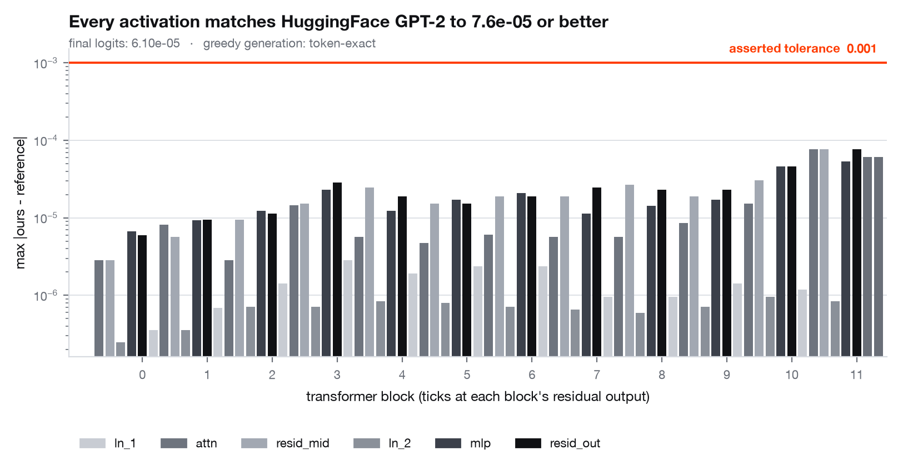

# transformer-internals

[](https://github.com/MartinMashalov/transformer-internals/actions/workflows/ci.yml)
[](LICENSE)
[](pyproject.toml)
[](pyproject.toml)

**GPT-2, rebuilt from the paper, verified against the reference implementation to
6.1e-05 — then taken apart to measure what every part of it is actually worth.**



*Every sub-module of every one of the 12 blocks, compared against HuggingFace's
`GPT2LMHeadModel` on a fixed batch. The worst disagreement anywhere in the
network is 7.6e-05, against activations whose own magnitude reaches 3.0e+03.
Source: [`results/verification.json`](results/verification.json). A version sized
for a narrow column is at
[`assets/verification_web.png`](assets/verification_web.png).*

---

## The problem with "I built GPT-2 from scratch"

Nobody can tell whether it is correct.

The standard demonstration is a small model trained on Shakespeare, a loss curve
that goes down, and some generated text. That proves nothing. **A subtly wrong
attention mask still produces plausible text and a decreasing loss.** So does a
transposed projection, an off-by-one in the KV cache, the wrong GELU, or a
tokenizer that segments differently from the real one. Every one of those bugs is
invisible to the demonstration that is usually offered as evidence.

This repository takes the opposite approach, in four movements:

| | | |
|---|---|---|
| **Build** | GPT-2 in pure PyTorch, from the architecture up | [Part 1](#part-1--the-implementation) |
| **Verify** | prove it computes the same function as the reference | [Part 2](#part-2--verification) |
| **Measure** | use it as an instrument: ablations, and finding induction heads | [Part 3](#part-3--using-it-as-an-instrument) |
| **Optimise** | KV cache, quantization, pruning, distillation — measured, not asserted | [Part 4](#part-4--inference-efficiency) |

The order matters. Once the implementation is verified against known-good
weights, every measurement afterwards inherits that credibility: when the
quantized model's perplexity moves, that is quantization, not a bug.

---

## Part 1 — the implementation

Pure PyTorch. No `transformers` modelling code, no `nn.MultiheadAttention`, and
no `F.scaled_dot_product_attention` on the reference path — the q/k/v projection,
the head reshape, the scaled dot product, the causal mask, the softmax and the
output projection are all written out in
[`src/transformer_internals/model.py`](src/transformer_internals/model.py) so
they can be read and checked line by line. (`scaled_dot_product_attention` is
available behind a config flag as a speed arm, and a test asserts the two agree.)

- **Byte-level BPE** implemented from scratch — the byte↔unicode bijection, the
  regex pre-tokenizer, and rank-ordered merges — verified to produce *identical
  token ids* to the reference on emoji, CJK, Cyrillic and control bytes.
  Round-tripping alone would not be enough: a tokenizer can be losslessly wrong.
- Token + learned positional embeddings, weight tying, pre-LayerNorm blocks,
  GPT-2's tanh-approximated GELU, and the `0.02/sqrt(2·n_layer)` residual init.
- **KV cache** with per-layer state, plus greedy, temperature, top-k and top-p
  sampling.
- **Grouped-query and multi-query attention** (`n_kv_head`), which shrink the
  cache by exactly `n_head / n_kv_head`.
- Training loop with AdamW, cosine schedule with warmup, gradient clipping,
  gradient accumulation, and decay applied only to matmul weights.

Every parameter shape is checked against the published model:
`num_parameters() == 124,439,808`, asserted in
[`tests/test_model.py`](tests/test_model.py).

---

## Part 2 — verification

This is the headline. The published OpenAI GPT-2 124M weights are loaded into
this implementation, and it is proven to compute the same function as
HuggingFace's `GPT2LMHeadModel`. `transformers` is used *only* to fetch the
checkpoint and as the oracle; it is never on the forward path under test.

Four levels of evidence, each strictly harder to pass than the last.

| Level | What is checked | Result |
|---|---|---|
| **1. Activations** | every sub-module of every block, on a fixed batch | worst **7.63e-05** (`h.11.attn`), against activations of scale up to 3.0e+03 |
| **2. Final logits** | max abs difference, asserted in a test | **6.10e-05** — tolerance 1e-03 |
| **3. Greedy generation** | token-exact, 300 tokens, 5 prompts | **all 5 exact** — 1500 consecutive argmax agreements |
| **4. Perplexity** | held-out slice, both implementations | **19.5673** vs **19.5673**, differing by 1.2e-06 over 4,096 tokens |

Run it with `make verify`; the numbers above are read from
[`results/verification.json`](results/verification.json).

**Why 1e-03 and not zero.** These are floating-point computations, not symbolic
ones. We compute `(q @ kᵀ) / sqrt(d)` where the reference computes
`(q @ kᵀ) * (1/sqrt(d))`; our GELU is a different expression tree; matmul
reductions block differently. The observed error grows with depth exactly as
accumulated fp32 rounding should — visible in the headline figure — and lands at
6.1e-05 on logits whose own scale is ~1.7e+02, i.e. a relative error near 1e-06.
A bit-exact assertion would be the wrong test: it would fail on hardware that is
perfectly correct.

**The suite is shown to reject a wrong model.** A verification suite that has
never rejected anything is not evidence, so
[`tests/test_verification.py`](tests/test_verification.py) includes a negative
control: transposing *one* square projection — the classic bug that survives
because 768×768 still multiplies — must push the logits outside tolerance and
break token-exact generation. It does.

### Two real bugs this caught

Both would have passed a loss-curve-and-samples demonstration.

1. **The KV cache read its offset from layer 0.** `cache.seq_len` looked at
   layer 0's stored keys — which layer 0 had *already updated* for the current
   step. So every layer after the first computed `past_len` too large by `T` and
   sliced its causal mask at the wrong position. The model still produced fluent
   English. The cached-vs-uncached equality test caught it immediately.
2. **The loader silently dropped the qkv bias.** The ignore-list matched the
   suffix `attn.bias`, which also matches `attn.c_attn.bias`. The model loaded
   without error, ran, and generated text — with no query/key/value bias in any
   block.

---

## Part 3 — using it as an instrument

### What each design decision is worth

Nine configurations, each changing exactly one field against a shared baseline,
all trained under an identical budget with identical data order and **three
seeds**. Reported as mean ± standard deviation of final validation loss.


*Source: [`results/ablations.json`](results/ablations.json). Narrow-column
version: [`assets/ablations_web.png`](assets/ablations_web.png).*

| Configuration | Val loss (3 seeds) | Δ vs baseline | Verdict | s/run |
|---|---|---|---|---|
| GPT-2 defaults | 4.0226 ± 0.0362 | — | reference | 44.7 |
| sinusoidal positions | 5.8588 ± 0.0148 | **+1.8362** | worse | 36.6 |
| post-LN | 4.6267 ± 0.0216 | **+0.6041** | worse | 40.0 |
| no residual-scaled init | 4.1063 ± 0.0308 | **+0.0837** | worse | 35.5 |
| ReLU instead of GELU | 4.0298 ± 0.0399 | +0.0072 | *indistinguishable* | 28.2 |
| 16 heads × 16 dim | 4.0265 ± 0.0370 | +0.0039 | *indistinguishable* | 43.3 |
| 4 heads × 64 dim | 4.0194 ± 0.0365 | −0.0032 | *indistinguishable* | 49.2 |
| 2 heads × 128 dim | 4.0160 ± 0.0376 | −0.0067 | *indistinguishable* | 42.5 |
| untied embeddings | 3.9439 ± 0.0362 | **−0.0787** | better | 37.2 |

*6 layers, 256 wide, 250 steps, TinyStories. "Indistinguishable" means
`|Δ|` did not exceed the pooled seed-to-seed standard deviation — a deliberately
conservative bar, stated once in the code so it cannot drift.*

Three findings worth stating plainly:

- **Head count, at fixed parameter count, did not matter.** 16×16, 8×32, 4×64 and
  2×128 are the same model size and the same FLOPs, and all four land inside one
  standard deviation of each other. This is a null result and it is reported as
  one. At this scale and budget, how the residual stream is partitioned into
  heads is not what is limiting the model.
- **GELU vs ReLU was also indistinguishable** (+0.007 against a spread of 0.040).
- **Untying the embeddings *helped*** (−0.079). That is the opposite of the usual
  telling, and it is not mysterious: untying adds 1.0M parameters to a 5.8M-parameter
  model, and at this scale the extra capacity is worth more than the
  regularisation tying provides. It is a reminder that GPT-2's choices were made
  at GPT-2's scale.

The two decisions that mattered enormously — learned positions and pre-LN — are
both about **how information moves through depth**, not about capacity.

### Finding induction heads

An **induction head** implements `[A][B] … [A] → [B]`: having seen a bigram, it
predicts the continuation when the first token recurs. Olsson et al. (2022)
identify it as a mechanism behind in-context learning. The prediction is
falsifiable and completely specific: on random tokens repeated twice, such a head
at position `i` must attend to position `i − (T−1)`.


*Per-head prefix-matching score on `[BOS] X X` with `X` a 60-token random
sequence. Chance is 0.011. Source:
[`results/induction.json`](results/induction.json).*

**The induction heads in GPT-2 small are L5H5, L6H9, L7H10, L5H1 and L7H2** —
scoring 0.94, 0.93, 0.92, 0.91 and 0.85 against a chance level of 0.011, i.e.
~80× chance. The other half of the circuit is also visible: the strongest
**previous-token head is L4H11 at 0.99**, sitting below the induction heads, which
is exactly the ordering the circuit requires in order to compose.

Behaviourally, the mechanism does what it claims: on the repeated sequence, the
model's loss falls from **12.262 nats on the first copy to 0.365 on the second** —
an induction bump of 11.9 nats on tokens that are, by construction,
unpredictable.

Two honest negatives:

- **The copying score works, but it does not select the induction heads.**
  Passing token embeddings through a head's OV circuit `W_U W_O W_V W_E` and
  asking how often the token's own identity comes out on top does find a real and
  distinct population of copying heads — **L11H3 (0.639), L11H10 (0.605), L7H8
  (0.552)**, with 17% of all heads above 0.1 against a median of 0.001. But all
  five prefix-matching heads score essentially zero on it (L5H5: 0.008, L7H2:
  0.000). Folding in the LayerNorm gains does not change this (tested). The
  construction only sees the *direct* path to the unembedding, whereas an
  induction head writes into a residual stream that later layers read and
  transform — so "attends to the right place" and "copies via its own direct
  path" turn out to be nearly disjoint properties in GPT-2 small. The one head
  scoring highly on both is **L11H10** (prefix 0.414, copying 0.605).
- **Attending to the right place is not the same as mattering.** Zeroing each
  head in turn and measuring the damage to second-copy loss gives a *different*
  ranking: the most damaging heads are **L0H0 (+0.81 nats)** and **L1H10
  (+0.42)**, which have near-zero prefix-matching scores — they are upstream of
  the circuit. Only **L5H1 (+0.41)** appears near the top of both lists. The
  attention pattern identifies the mechanism; only ablation shows it is used.

---

## Part 4 — inference efficiency

### The KV cache, measured rather than asserted


*Source: [`results/kv_cache.json`](results/kv_cache.json), Apple M-series MPS,
32 new tokens, median of 3 runs.*

| Prompt length | no cache (ms/token) | KV cache (ms/token) | Speedup |
|---|---|---|---|
| 16 | 33.29 | 31.85 | 1.05× |
| 64 | 31.74 | 32.03 | 0.99× |
| 128 | 31.53 | 31.63 | 1.00× |
| 256 | 34.06 | 33.58 | 1.01× |
| 512 | 63.84 | 36.87 | **1.73×** |
| 768 | 131.09 | 34.67 | **3.78×** |

The cached arm is **flat** — ~32 ms per token regardless of context, the signature
of O(1) per-token work — while the uncached arm grows linearly per token and
therefore quadratically in total. **The crossover is around 256–512 tokens**: below
that the cache buys nothing on this hardware, because the per-step overhead of
concatenating and writing cache tensors is the same order as the work it saves.
The usual claim that a KV cache is a strict win is only true past that point.

### Cache memory is the number that decides serving capacity


GPT-2 124M in fp32 stores **73,728 bytes of cache per token per sequence**
(`2 × 12 layers × 12 heads × 64 dims × 4 bytes`). The analytic formula was checked
against the actually-allocated tensors and matches exactly (ratio 1.0000).

| Context | Batch | Cache | vs model weights (497.8 MB) |
|---|---|---|---|
| 1024 | 1 | 75.5 MB | 0.15× |
| 1024 | 8 | 604.0 MB | **1.21×** |
| 512 | 32 | 1208.0 MB | 2.43× |
| 1024 | 32 | 2415.9 MB | **4.85×** |

At batch 8 and full context the cache is already larger than the model. This is
why modern models use grouped-query attention, and the saving is exact:

| Variant | KV heads | Cache @1024×8 | Reduction |
|---|---|---|---|
| MHA (GPT-2) | 12 | 604.0 MB | 1× |
| GQA-4 | 4 | 201.3 MB | **3×** |
| GQA-2 | 2 | 100.7 MB | **6×** |
| MQA | 1 | 50.3 MB | **12×** |

Both variants are implemented (`n_kv_head`), and the cache stores the
*unexpanded* keys and values — expanding before caching would pay the quality
cost while throwing away the entire memory win.

### Quantization: the granularity of the scale is the whole story


*Symmetric linear quantization implemented directly (`quantize_tensor`,
`pack_int4`). Sizes are real files on disk — int4 codes are genuinely packed two
per byte. Source: [`results/quantization.json`](results/quantization.json).*

| Scheme | Perplexity | Δ ppl | On disk | Compression |
|---|---|---|---|---|
| fp32 reference | 18.27 ± 2.35 | — | 497.8 MB | 1.00× |
| int8 per-channel | 18.31 ± 2.34 | **+0.03** | 243.4 MB | 2.05× |
| int8 per-tensor | 20.44 ± 2.60 | +2.17 | 243.0 MB | 2.05× |
| int4 per-channel | 24.01 ± 3.14 | +5.74 | 200.9 MB | 2.48× |
| int4 per-tensor | **2291.84 ± 212.24** | +2273.56 | 200.6 MB | 2.48× |
| int8 per-channel + embedding | 19.68 ± 2.46 | +1.41 | 127.8 MB | **3.90×** |

**int8 with per-channel scales is essentially free** (+0.03 perplexity, well
inside the ±2.35 spread of the estimate itself). The same bit width with a single
per-tensor scale costs +2.17. At 4 bits the difference is no longer a tradeoff but
a cliff: per-channel degrades gracefully to 24.0, **per-tensor collapses to
2291.8** — one outlier weight sets the step size for the entire matrix and
everything else quantizes to near-zero.

Note the compression ratios: int8 only reaches 2.05×, not 4×, because the 38.6M-parameter
embedding stays in fp32. Quantizing it too reaches 3.90× for +1.41
perplexity — and under weight tying that tensor is also the output head, which is
why it is the most sensitive one in the model.

**On speed:** these are *simulated* quantization measurements — weights are
quantize-dequantized, so the forward pass computes exactly what a real integer
kernel would compute from the same weights, but runs at fp32 speed. PyTorch 2.2
ships no int4 kernel and no int8 MPS kernel, so a tokens/sec speedup cannot be
measured here honestly, and none is claimed. The quality and size numbers are
real and hardware-independent.

### Structured pruning


Heads and MLP neurons are ranked by `|∂L/∂ξ|` — the gradient of the loss with
respect to a multiplicative mask held at 1 (Michel et al., 2019) — normalised
within each layer, then pruned globally. Structured, not unstructured: removing a
whole head or neuron removes whole rows and columns, so the FLOPs actually go
away.

| Sparsity | Heads: params removed → loss | Neurons: params removed → loss |
|---|---|---|
| 0% | 0.0% → 3.0042 | 0.0% → 3.0042 |
| 10% | 2.2% → 3.7932 | 4.6% → 3.1098 |
| 20% | 4.6% → 4.2250 | 9.1% → 3.3130 |
| 30% | 6.8% → 5.3066 | 13.7% → 3.8307 |
| 50% | 11.4% → 5.8450 | 22.8% → 6.2595 |

**MLP neurons prune far more gracefully than attention heads.** Removing 9.1% of
parameters as neurons costs 0.31 nats; removing 4.6% as heads costs 1.22 nats —
**half as many parameters removed, four times the damage**. GPT-2 small does not
have redundant heads to spare.

**Tying this back to the induction result.** Pruning heads destroys induction
behaviour quickly: second-copy loss on the repeated-sequence probe rises from
0.378 (unpruned) to **3.69 at 10% head sparsity** and 17.80 at 70%. And the
gradient criterion, which ranks heads by their contribution to *language-modelling*
loss, correlates only **+0.11 (Spearman)** with direct-ablation damage to
*induction*. Those are two different notions of importance, and a pruning
criterion optimised for one will happily delete the heads that carry the other.

### Distillation

The same 4-layer student trained twice under an identical budget with identical
batches — once on hard labels, once against the verified teacher's distribution,
with α swept — on CPU, because this experiment needs the full 50257-token
vocabulary and that is exactly where MPS stops being reproducible (see below).


| Arm | Val loss (2 seeds) | Δ vs from-scratch | Verdict | s/run |
|---|---|---|---|---|
| from scratch | 5.0130 ± 0.0231 | — | reference | 68 |
| distilled α=0.1 | 4.9946 ± 0.0208 | -0.0184 | *indistinguishable* | 177 |
| distilled α=0.5 | 5.2576 ± 0.0258 | +0.2446 | worse | 175 |
| distilled α=0.9 | 6.0593 ± 0.0020 | +1.0463 | worse | 167 |

*Source: [`results/distillation.json`](results/distillation.json). 4-layer,
256-wide student, 150 steps, full 50257-token vocabulary shared with the teacher.*

**Distillation did not help at this budget.** The best arm (α=0.1) finishes
0.0184 nats below the control, against a pooled standard deviation
of 0.0311 — inside the noise, so *indistinguishable*. Raising α makes
it monotonically worse: at α=0.9, where the soft targets dominate the hard
labels, the student is 1.05 nats behind. And it costs **2.6× the
wall-clock**, because every step runs a 124M-parameter teacher forward to train a
5.8M-parameter student.

This is a negative result at a small budget, not a refutation of distillation.
150 steps is far too few for a student to exploit the teacher's distribution,
and the teacher itself is only moderately good on this corpus. What the
experiment does establish is the methodology: identical student, identical
batches, identical seeds, α swept rather than chosen, and the cost reported next
to the quality.

### The frontier


*Every configuration re-scored by one function on the same
6,144 held-out tokens, so the points are actually
comparable. The other scripts each use their own evaluation slice, and putting
those numbers on one chart would be a quiet apples-to-oranges comparison. Source:
[`results/pareto.json`](results/pareto.json).*

**No pruning configuration is on the Pareto front.** Every one of the eight
pruned models is dominated — there is a quantized model that is both smaller and
better. int8 per-channel is 243 MB at perplexity 18.8 against the fp32 baseline's
498 MB at 18.7; the best pruned model that gets anywhere near that size is
`neur -50%` at 384 MB and perplexity 506.8.

For a model of this size, **quantization is simply the better lever**: it removes
bytes without removing structure, while structured pruning removes capacity the
model is still using. (The front does formally include int4 per-tensor at
perplexity 2367, because nothing else is smaller and so nothing can dominate it.
That is a property of how dominance is defined, not a recommendation.)

---

## What I learned that the tutorials skip

**A KV cache bug is invisible in the output.** The offset bug above produced
perfectly fluent text. The only thing that catches it is asserting cached and
uncached generation are *token-identical*, which is now a test.

**HuggingFace's `output_hidden_states` applies the final LayerNorm before
appending the last entry.** Comparing our raw block-11 residual against
`hidden_states[-1]` reported a difference of 3.7e+02 on a model that was
completely correct. Verification harnesses have bugs too, and a harness bug looks
exactly like a real one — the fix was to capture `ln_f`'s *input*.

**The GELU you pick is not cosmetic.** GPT-2 shipped the tanh approximation, not
the exact erf form. The two differ by up to **4.74e-04** (at x = 2.70), which is
almost an order of magnitude larger than the 6.1e-05 this implementation actually
achieves on the final logits — so picking the wrong one turns a verified model
into an unverified one.

**Non-determinism will quietly destroy an ablation table.** The first version of
the ablation grid ran on MPS at lr 6e-4 and produced **3.89 and 5.95 from two runs
at the same seed**. The cause: the MPS backward is not bit-deterministic — its
bias gradients are atomic reductions, and repeated identical backward passes
differ by ~3e-03 — and an optimisation sitting near an instability amplifies that
into an entirely different trajectory. The fix was a stabler learning rate and a
smaller output layer, after which repeated runs in one process are bit-identical
and across processes agree to ~2e-04, two orders of magnitude below the 0.036
seed-to-seed spread. **Every number in an ablation table is worthless without
this check**, so it is now a test rather than an assumption.

**"No measurable difference" is a result.** Four of the eight ablations landed
inside the seed spread. Reporting them as wins by picking a favourable seed would
have been easy and is the default failure mode of this genre.

**The cache is a memory problem before it is a compute problem.** At batch 8 and
1024 tokens, GPT-2's KV cache is 1.21× the size of the model itself. That single
ratio explains grouped-query attention better than any diagram.

**Per-channel scales are not a refinement, they are the thing that makes low-bit
quantization work at all.** int4 per-tensor: perplexity 2292. int4 per-channel:
24. Same bit width, same size on disk, two orders of magnitude of quality.

---

## Limitations

Stated plainly, because the point of the repository is calibration.

- **The ablations are small.** 6 layers, 256 wide, 250 steps, 4096-token
  vocabulary, ~0.9M training tokens. Conclusions are about *this* regime. The
  untied-embeddings result in particular is a small-scale artefact of extra
  capacity and should not be read as advice for a 124M model.
- **Three seeds** is enough to see whether an effect clears the noise floor, not
  enough for a formal test. The tables report the effect against the spread and
  say so, rather than dressing it up as significance.
- **The ablation corpus is TinyStories**, which is deliberately simple. Effects
  that only appear on harder distributions will not show up.
- **Quantization is simulated**, not kernel-accelerated. Quality and size are
  real; no speedup is claimed.
- **Pruning is masked, not physically removed.** Parameter counts are what a real
  implementation would delete; the FLOPs are not actually saved in this code.
- **The copying score is a direct-path construction** and does not fold in
  LayerNorm gains; it is reported as an uninformative measurement rather than
  quietly dropped.
- **Latency numbers are Apple MPS**, one machine, median of 3. The *shape* of the
  curves is the robust finding; the absolute milliseconds are not portable.
- **Only GPT-2 124M is verified.** The loader is written for the general shape and
  the larger sizes should load unchanged, but "should" is not "does" and they are
  not tested.
- **No distributed training, no flash-attention kernel, no fused ops.** Out of
  scope.

---

## Quickstart

```bash
git clone https://github.com/MartinMashalov/transformer-internals
cd transformer-internals
make install          # creates .venv, installs with dev + verify extras

make test-fast        # what CI runs: no weights, no network (~7 s)
make verify           # Part 2: prove equivalence to GPT-2 (~2 min + checkpoint download)
make induction        # Part 3: find the induction heads (~5 min)
make ablate           # Part 3: 9 configurations x 3 seeds (18 min measured)
make kv               # Part 4: KV cache latency and memory (~2 min)
make quantize         # Part 4: int8/int4, per-tensor vs per-channel (~4 min)
make prune            # Part 4: structured pruning (~5 min)
make distill          # Part 4: distillation vs from-scratch (20 min measured, CPU)
make pareto           # Part 4: one comparable size/quality frontier (~4 min)
make figures          # redraw every figure from committed results
```

Generating text with the verified model:

```python
import torch
from transformer_internals.weights import load_pretrained_gpt2
from transformer_internals.tokenizer import BPETokenizer
from transformer_internals.sampling import generate

model, ckpt = load_pretrained_gpt2()          # our implementation, OpenAI's weights
tok = BPETokenizer.from_pretrained(ckpt)      # our BPE, OpenAI's vocab

ids = torch.tensor([tok.encode("The capital of France is")])
out = generate(model, ids, max_new_tokens=40, do_sample=True, top_p=0.9,
               generator=torch.Generator().manual_seed(0))
print(tok.decode(out[0].tolist()))
```

Device: Apple Silicon MPS if available, else CPU. Verification runs on CPU by
default so the fp32 tolerances mean what they say.

---

## Repository layout

```
src/transformer_internals/
  config.py        GPTConfig / TrainConfig — every ablation switch, documented
  tokenizer.py     byte-level BPE from scratch
  model.py         attention, blocks, KV cache, GQA/MQA, the model
  sampling.py      greedy / temperature / top-k / top-p, cached decoding
  train.py         AdamW, cosine schedule, clipping, accumulation
  data.py          corpus loading, compact vocabulary, batching
  weights.py       load the published GPT-2 checkpoint into our modules
  verify.py        Part 2 — the equivalence harness
  ablations.py     Part 3 — the grid and its verdict rule
  induction.py     Part 3 — prefix-matching, copying, causal head ablation
  benchmark.py     Part 4 — latency, throughput, cache memory
  quantization.py  Part 4 — int8/int4, packing, perplexity with error bars
  pruning.py       Part 4 — gradient-based importance, structured masks
  distill.py       Part 4 — teacher/student
  viz.py           every figure, from committed results only

scripts/           one runner per experiment + make_figures + make_pareto
results/           committed JSON — every number in this README comes from here
assets/            committed figures, each with a *_web.png variant
tests/             75 tests; the weight-dependent ones are marked `weights`
```

## Tests

```
pytest -q                    # 75 passed
pytest -q -m "not weights"   # 66 passed — what CI runs, offline, CPU-only
```

The suite includes: BPE round-trip *and* exact agreement with the reference
segmentation; the causal mask asserted directly (no position attends to the
future, every row sums to 1); attention against a naive triple-loop reference;
the fused-SDPA arm against the reference path; cached vs uncached generation
token-identical; future tokens provably unable to change earlier logits;
`ln(vocab_size)` loss at init; weight tying sharing storage; the residual-init
scale factor; the lr schedule shape; bit-reproducible training under a fixed
seed; the quantization error bound (`≤ scale/2`), int4 pack round-trip, and
per-channel beating per-tensor on an outlier row; pruning parameter accounting;
the KV cache formula against allocated tensors; and the Part 2 equivalence tests
with a negative control that must fail on a deliberately broken model.

---

## References

- Radford et al. (2019), *Language Models are Unsupervised Multitask Learners*
- Vaswani et al. (2017), *Attention Is All You Need*
- Hendrycks & Gimpel (2016), *Gaussian Error Linear Units*
- Xiong et al. (2020), *On Layer Normalization in the Transformer Architecture*
- Olsson et al. (2022), *In-context Learning and Induction Heads*
- Michel, Levy & Neubig (2019), *Are Sixteen Heads Really Better than One?*
- Shazeer (2019), *Fast Transformer Decoding*; Ainslie et al. (2023), *GQA*
- Hinton, Vinyals & Dean (2015), *Distilling the Knowledge in a Neural Network*
- Holtzman et al. (2020), *The Curious Case of Neural Text Degeneration*
- Eldan & Li (2023), *TinyStories*

## License

MIT — see [LICENSE](LICENSE).
