# gpt2-harness

[](https://github.com/MartinMashalov/gpt2-harness/actions/workflows/ci.yml)
[](LICENSE)
[](pyproject.toml)
[](pyproject.toml)

**A training harness, built from the parts up: five parallelism strategies, each
proven to compute the same function as a single process to 2.4e-06, with the
bytes each one moves counted exactly. A roofline and an MFU measured on real
hardware. A throughput diagnosis tool that named the injected fault in all four
broken runs it was handed, and stayed quiet on the control. Sharded checkpoints
that reshard bitwise across a change of world size, and a rank killed with
SIGKILL whose restarted loss curve matches the uninterrupted one exactly.**

Underneath it is a from-scratch GPT-2 verified against HuggingFace to 6.1e-05,
which is what makes every measurement above mean something: when a sharded
implementation disagrees with the reference, it is the sharding.

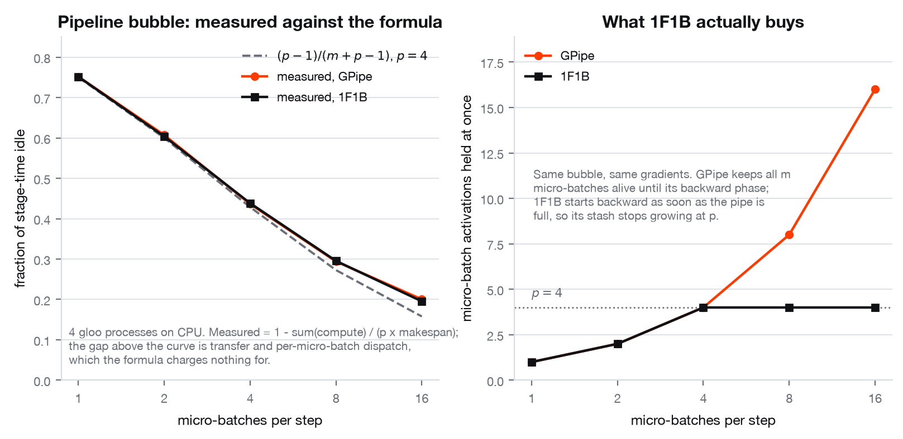

*Four gloo processes on CPU, 8 blocks split into 4 stages. Left: the measured
idle fraction against `(p-1)/(m+p-1)`, for GPipe and 1F1B. Right: the activation
stash, which is the only place the two schedules differ. Source:
[`results/parallel_comms.json`](results/parallel_comms.json). Narrow-column
version: [`assets/parallel_bubble_web.png`](assets/parallel_bubble_web.png).*

---

## What this is

There is no GPU cluster here. This was built on one laptop, and pretending
otherwise would be the easiest claim in the repository to catch. So the work is
arranged around the parts of distributed training that a laptop can actually
settle, and every number is labelled with which kind it is:

- **MEASURED.** Run on this machine and written to a file in `results/`. Every
  parallelism strategy is implemented against real `torch.distributed`, one OS
  process per rank, gloo backend, and checked against a single-process
  reference. Correctness of a sharded implementation is hardware-independent: a
  reduce-scatter that drops a shard is wrong on a laptop and wrong on 512 GPUs.
  Collective volumes are counted by instrumenting the collectives themselves,
  not estimated.
- **MODELLED.** Computed from published interconnect bandwidths, with the
  datasheet quoted next to the number, and validated in *shape* against a real
  collective measured here. Nothing in this repository was run on an H100 and
  nothing claims to have been.

The machine: Apple M1 Max, 10 CPU cores, 24-core GPU, 32 GiB unified memory,
macOS 15.6.1, PyTorch 2.2.2, fp32 throughout. The interpreter is an x86_64 build
running under Rosetta 2, which is why `platform.platform()` in every committed
JSON reads `macOS-10.16-x86_64`; MPS is available and is what the GPU numbers
were measured on.

| | | |
|---|---|---|
| **Shard** | data, sharded-data, tensor, pipeline and context parallelism, each proven equivalent to one process | [Part 1](#part-1--parallelism-proven-not-asserted) |
| **Profile** | measured roofline, MFU, and an operator-level profile of a real step | [Part 2](#part-2--roofline-and-mfu) |
| **Diagnose** | four throughput pathologies injected, four found and quantified | [Part 3](#part-3--why-is-this-run-slow) |
| **Survive** | resharding checkpoints, killing a rank, restarting, streaming data | [Part 4](#part-4--the-harness-checkpoints-failure-and-data) |
| **Build** | GPT-2 in pure PyTorch, from the architecture up | [Part 5](#part-5--the-implementation) |
| **Verify** | prove it computes the same function as the reference | [Part 6](#part-6--verification) |
| **Measure** | ablations, induction heads, and inference efficiency | [Parts 7-8](#part-7--using-it-as-an-instrument) |

---

## Part 1. Parallelism, proven not asserted

Five strategies, in
[`src/transformer_internals/parallel/`](src/transformer_internals/parallel).
Each one runs on real `torch.distributed` processes over gloo and is compared
against a single process computing the same thing unsharded. The comparison is
the point. Anyone can write a `dist.all_reduce` call; the question is whether
the thing around it computes the same function.

**Worst disagreement with the single-process reference, anywhere in the table
below: 2.4e-06.** Source for every number here:
[`results/parallel_comms.json`](results/parallel_comms.json), written by
`make parallel` in 104 seconds.

| strategy | what it shards | what it communicates per step | worst error vs one process | measured payload/rank/step | closed form, checked exactly |
|---|---|---|---|---|---|
| data parallel (DDP) | the batch | 1 all-reduce of the gradients | **7.8e-08** grads, 7.5e-09 params after SGD | 228,096 B | `4N` |
| ZeRO-1 | optimiser state | all-reduce + all-gather | **1.4e-06** over 4 AdamW steps | 456,192 B | `4N` + `4N` |
| ZeRO-2 | + gradients | reduce-scatter + all-gather | **1.4e-06** | 456,192 B | `4N` + `4N` |
| ZeRO-3 (FSDP) | + parameters | 2 all-gathers and 1 reduce-scatter per unit | **1.4e-06** | 634,624 B | `8N_unit` + `4N_unit` |
| tensor parallel | every weight in the block | 4 all-reduces of activations per block | **3.6e-07** forward, **1.9e-06** backward | 24,576 B | `4 · 4BTC` |
| pipeline, GPipe and 1F1B | layers into stages | 1 send + 1 recv per stage boundary | **3.0e-08** on every stage gradient | 32,768 B over 3 boundaries | `4BTC` per boundary |
| context parallel, all-gather KV | the sequence | 2 all-gathers + 2 reduce-scatters | **0.0, bit-identical** | 61,440 B | `2 · 4BTC` |
| context parallel, ring | the sequence | `2(p-1)` sends and recvs | **1.2e-07** | 8,192 B of ring p2p | `2(p-1)/p · 4BTC` |
| DTensor | same sharding as above, expressed as placements | (as tensor parallel) | **0.0** against the hand-written version | | |

The errors are compared against the scale of what is being compared, which is
also in the JSON: tensor-parallel gradients reach 22.1, context-parallel weight
gradients reach 14.6, pipeline stage gradients reach 0.145. A 1.9e-06 error on a
value of 22.1 is a relative error near 1e-07.

**Why ZeRO is 1.4e-06 and not zero, checked rather than assumed.** At world size
1 the first step is exactly 0.0, which proves the hand-written AdamW is
bit-identical to `torch.optim.AdamW`. At world size 2 the gradient reduction
differs from the single-process gradient by 3e-08 through float
non-associativity, and Adam's `g/sqrt(g²)` amplifies that on parameters whose
gradient is near zero. The error does not grow: 1.44, 1.44, 1.39, 1.37 e-06
over the four steps.

### The bytes are counted, not estimated

Every collective goes through a counting wrapper, so the byte figures above are
the payloads that actually crossed the call. All ten closed forms matched the
measured count **exactly** (`formula_checks` in the JSON, every entry
`exact_match: true`).

Two results fall out of that:

**ZeRO-2 and DDP move identical wire volume.** 228,096 bytes per rank per step
each, under the ring model. That is not a coincidence and it is not asserted: an
all-reduce *is* a reduce-scatter followed by an all-gather, so splitting it into
those two halves and keeping only your shard of the gradient costs nothing in
traffic. ZeRO-2 is free memory.

**Tensor parallelism is the expensive axis, and the reason is in the formula.**
Its volume is `4BTC` per block per step, which scales with *tokens*, while data
parallelism moves `4N`, which scales with *parameters*. At the toy size that is
24,576 bytes against 228,096. Projected to GPT-2 124M at OpenAI's batch of
512x1024 tokens, it inverts: 77.3 GB of all-reduce across 12 blocks against 498
MB for DDP (**modelled**, same formulas, evaluated at N = 124,439,808).

### Memory per rank, measured from live tensor storages

World size 2, on the tested model, in bytes. Every column is measured: the first
three from the actual tensor storages, the fourth from the tensors the autograd
graph is holding for the backward pass.

| | parameters | gradients | Adam state | state total | **activations** |
|---|---|---|---|---|---|
| one process, whole batch | 228,096 | 228,096 | 456,192 | 912,384 | **2,076,804** |
| replicated (DDP + AdamW) | 228,096 | 228,096 | 456,192 | **912,384** | 1,040,004 |
| ZeRO-1 | 228,096 | 228,096 | 228,096 | **798,336** | 1,040,004 |
| ZeRO-2 | 228,096 | 114,048 | 228,096 | **684,288** | 1,040,004 |
| ZeRO-3 | 126,464 | 126,464 | 252,928 | **607,488** | **84,612** |

Read against the row above it, each ZeRO stage removes exactly what it claims
to. The totals in the JSON carry one extra line, a flat per-element weight-decay
coefficient this implementation holds because a shard boundary can fall inside a
tensor; it is listed separately because it is not part of the Adam state the
ZeRO formulas describe.

**The activation column is the one that was missing, and it changes the
reading.** Activations are what actually runs a real training job out of memory,
and at this shape they are larger than the parameters, the gradients and the
Adam state put together. Three things fall out of it:

- **ZeRO does not shard activations.** 1,040,004 bytes on DDP, ZeRO-1 and
  ZeRO-2 alike, exactly half the single-process figure, and the half is because
  each rank sees half the batch. Nothing about sharding the optimiser touches an
  activation. Stage 2 cuts 228,096 bytes of state and leaves 1,040,004 bytes
  standing next to it.
- **ZeRO-3's 84,612 is not sharding either, it is recomputation.** This
  implementation runs each unit under `no_grad` and recomputes it during the
  backward pass, so the forward keeps each unit's *input* and not its interior:
  12x less. The bill arrives later, as one block's activations live again while
  that block is being recomputed, and as a second forward pass of arithmetic.
  That is activation checkpointing, stated as a measurement rather than as a
  footnote.
- **Tensor and pipeline parallelism do shard them.** One block, same batch on
  every rank: 103,824 bytes per rank against 182,160 unsharded, a factor of
  0.57 rather than 0.50 because the residual stream and the LayerNorm inputs
  stay replicated while the `4C` MLP hidden and the per-head attention tensors
  do not. And across four pipeline stages, peak bytes per stage:

  | schedule | stage 0 | stage 1 | stage 2 | stage 3 |
  |---|---|---|---|---|
  | GPipe | 496,128 | 494,592 | 494,592 | 594,960 |
  | 1F1B | 496,128 | 375,040 | 255,488 | **153,604** |

  The staircase is 1F1B's whole reason for existing, and this is it in bytes
  rather than in a count of micro-batches: the deepest stage holds 3.9x less
  than it does under GPipe, because it starts its backward passes first and
  stops accumulating. Stage 3 carries the `lm_head` and the loss, which is why
  it is the largest under GPipe and still the smallest under 1F1B.

**The analytic count agrees with the measurement to the byte.**
`analytic_activation_bytes` enumerates the tensors this forward pass saves,
term by term, and equals the measured figure exactly for 1, 3 and 4 layers,
pre-LN and post-LN, all three activation functions, tied and untied heads, and
learned and sinusoidal positions. Getting there corrected four wrong
assumptions, each of which is a fact about autograd rather than about this
model: the tanh GELU leaves **four** extra `4C`-wide tensors in the graph
because it is written out of primitive operators; `relu` leaves **none**,
because it saves its output and the next projection already saves that same
tensor as its input; the cross entropy saves **one** `tokens x vocab` tensor and
not two, because the log-softmax backward is written in terms of its own output;
and `masked_fill` keeps the *inverted* causal mask, one byte per element and
quadratic in the sequence length. Because it is exact, it can be evaluated at a
shape nobody has run: GPT-2 124M at batch 8 x sequence 512 in fp32 needs
**6.29 GB** of activations, of which 0.82 GB is the log-softmax alone, more than
any single transformer block. At sequence 1024 it is 15.0 GB and the attention
probabilities go from 22% of a layer to 36%. Those two are **computed by the
validated count, not measured**, since neither shape has been run here.

The count is fp32 and **refuses to produce a bf16 number**, which is worth
saying because halving every term is the obvious thing to do and is wrong in the
unsafe direction. `torch.autocast` keeps LayerNorm, its saved statistics and the
cross-entropy log-softmax in fp32, and for GPT-2's vocabulary that last tensor
is the largest single term. Measured rather than argued: a bf16 autocast forward
holds **0.70x** of the fp32 stash on the tested model, not 0.50x. It also adds a
weight cache, one narrow copy of every weight an autocast operator consumed,
which the graph saves on its own storages; the meter finds those by walking each
saved tensor's `grad_fn` back through view and cast nodes and reports them as
parameter memory rather than as activations. Which operators autocast keeps in
fp32 is torch's policy, differs between CPU and CUDA, and has changed between
releases, so the measurement handles bf16 and the analytic count declines to.

### bf16 on the wire, and the fp32 master copy that makes it safe

Two dtypes, set independently, exactly as FSDP's
`MixedPrecision(param_dtype=..., reduce_dtype=...)` sets them: what the
*gradient* reduction carries, and what the *parameter* all-gather carries.
Neither is what the optimiser updates. Same four AdamW steps, same world size 2,
same comparison against single-process `torch.optim.AdamW`, changing only the
dtype of a collective. Source:
[`results/parallel_comms.json`](results/parallel_comms.json) -> `mixed_precision`.

| reduce | param | DDP bytes/step | ZeRO-2 bytes/step | worst trajectory error | vs all-fp32 |
|---|---|---|---|---|---|
| fp32 | fp32 | 228,096 | 456,192 | **1.44e-06** | 1x |
| bf16 | fp32 | **114,048** | **342,144** | **1.04e-03** | 726x |
| fp32 | bf16 | 228,096 | 342,144 | **3.91e-03** | 2713x |

**The gradient reduction halves exactly and costs three orders of magnitude.**
114,048 is 228,096/2, which is the point of doing it: on a step that is
communication-bound, this is the cheapest halving available. What it buys is
paid for in accuracy, and 1.04e-03 is the size of the bill.

**The error does not compound, and that is the fp32 master shard working.** Over
the four steps the bf16-reduction error goes 1.00, 1.02, 1.04, 1.04 e-03: flat.
Each step injects a fresh rounding and none of it accumulates, because the AdamW
update is applied to an fp32 copy that the bf16 collective never touches. A
sharded optimiser that kept its state at the wire dtype would show this column
growing instead.

**The parameter all-gather is the more expensive of the two, and the number says
why.** 3.906e-03 is 2^-8, which is bf16's worst rounding error at 1.0 (its grid
spacing there is 2^-7), and the largest parameter in the tested model is a
LayerNorm gain sitting at 1.0. The error is not mysterious drift; it is one
quantisation step on the biggest weight.

The fp32 master shard is allocated **only** when the parameter all-gather is
narrower than fp32. With an fp32 gather the replicated parameters already are
the master copy, and a second one would be `4N/p` bytes per rank of pure
duplication. ZeRO-3 never needs one at any dtype, because its shard is a real
`nn.Parameter` that no gather overwrites. That asymmetry is why the memory table
above is unchanged by any of this.

### Clipping a gradient no rank holds all of

Every real training recipe clips the global gradient norm at 1.0. Under sharding
that is not a local operation: rank `r` holds a slice, and the norm is over all
of it, so the ranks have to agree on one scalar before any of them updates.

| stage | extra collectives per step | extra bytes per step | norm vs `torch.nn.utils.clip_grad_norm_` | parameter error, clipped |
|---|---|---|---|---|
| ZeRO-1 | **0** | 0 | 1.2e-07 | 1.53e-06 |
| ZeRO-2 | 1 all-reduce | **4** | 6.0e-08 | 1.53e-06 |
| ZeRO-3 | 1 all-reduce | **4** | 6.0e-08 | 1.53e-06 |

**ZeRO-1 clips for free and ZeRO-2 does not**, which is a consequence of what
each one holds rather than a design choice: stage 1 all-reduces the whole
gradient anyway, so every rank can take the norm locally; stage 2
reduce-scatters, so no rank has more than its slice. The extra collective is
four bytes. It carries no bandwidth at all, which means it is entirely latency,
and latency is the expensive kind of collective. Both closed forms are checked
alongside the other eight in `formula_checks`, and all ten match exactly.

ZeRO-3 has to add its two kinds of parameter separately. The unit shards are
disjoint and must be summed across ranks; the root parameters have already been
all-reduced, so they are identical everywhere and adding them *before* the
collective would count them `p` times and shrink that part of the norm by
`sqrt(p)`. That is a bug that grows with the world size and therefore passes on
one GPU.

The clip reproduces `torch.nn.utils.clip_grad_norm_` to 6e-08 on the norm
itself, epsilon and clamp included, and the clipped trajectory still tracks a
clipped single-process reference at 1.53e-06 against 1.44e-06 unclipped. The
clip bites: the reference norms over the four steps are 1.288, 0.880, 0.955,
0.919, so step 1 is genuinely scaled down and the rest are not.

### The pipeline bubble, measured against the formula

Four gloo processes, 8 blocks, 128 wide, batch 16, sequence 128, fastest of
three repeats. Measured bubble is `1 - sum(compute) / (p × makespan)`.

| micro-batches | `(p-1)/(m+p-1)` | measured GPipe | measured 1F1B | GPipe stash | 1F1B stash |
|---|---|---|---|---|---|
| 1 | 0.750 | 0.752 | 0.752 | 1 | 1 |
| 2 | 0.600 | 0.605 | 0.607 | 2 | 2 |
| 4 | 0.429 | 0.446 | 0.448 | 4 | 4 |
| 8 | 0.273 | 0.306 | 0.307 | 8 | **4** |
| 16 | 0.158 | 0.215 | 0.215 | 16 | **4** |

The measured curve sits slightly above the formula and the gap grows with `m`,
because the formula charges nothing for the gloo transfers or the
per-micro-batch Python dispatch, and both grow as micro-batches shrink. The
schedules have the same bubble and produce the same gradients to 3.0e-08. The
whole of 1F1B's win is the last two columns: GPipe holds every micro-batch's
activations until its backward phase, 1F1B starts backward as soon as the pipe
is full, so its stash stops growing at `p`. A dependency-respecting simulation
of both schedules reproduces `(p-1)/(m+p-1)` to 1e-12 for every `(p, m)` in
`{2,4,8} × {1,2,4,8,16}`.

### What is not here

Ring attention is forward-only; its backward needs a second ring carrying dK/dV,
and the all-gather-KV path, which is differentiable end to end, is what the
backward equivalence test uses. ZeRO-3 recomputes each unit's forward during the
backward pass, because the gathered parameters are genuinely freed after the
forward, so it is FSDP plus activation checkpointing rather than FSDP alone. The
DTensor demo uses a 1-D mesh; composing data x tensor parallelism on a 2-D mesh
is the obvious next step. All three are stated in the module docstrings.

---

## Part 2. Roofline and MFU

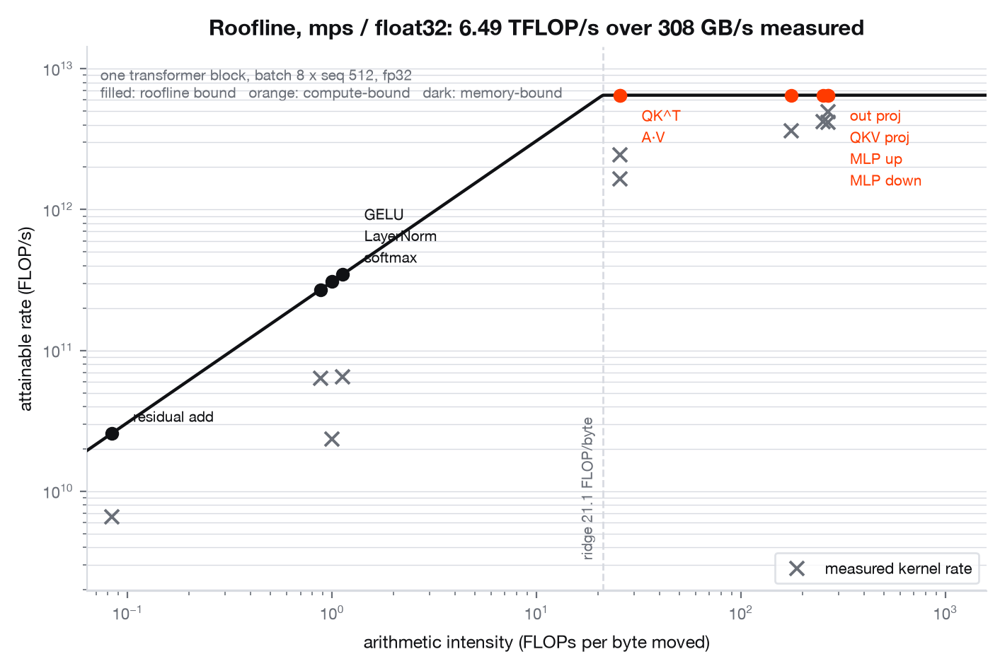

*Every operator of a GPT-2 block at batch 8 x sequence 512, placed on the
machine's measured roofline. Orange is compute-bound, dark is memory-bound, and
the grey crosses are the real PyTorch kernels timed at the same shape. Source:
[`results/roofline.json`](results/roofline.json). Narrow-column version:
[`assets/roofline_web.png`](assets/roofline_web.png).*

Both ends of the roof were measured rather than taken from a datasheet: a GEMM
sweep for peak achievable FLOP/s, a STREAM triad for peak achievable bandwidth.

| device | peak compute | peak bandwidth | ridge point | source |
|---|---|---|---|---|
| MPS, 24-core GPU | **6.489 TFLOP/s** | **308 GB/s** | 21.07 FLOP/byte | [`results/roofline.json`](results/roofline.json) |
| CPU, 10 cores | 0.275 TFLOP/s | 105.5 GB/s | 2.61 FLOP/byte | [`results/diagnosis.json`](results/diagnosis.json) |

The sweeps are kept in the payload rather than collapsed to one number, because
the small sizes are cache and not DRAM: 88 GFLOP/s at N=256 rising to 6489 at
N=4096, and 117 GB/s on a 16 MiB array rising to 308 GB/s on 512 MiB. For
context, and not as a claim: Apple publishes 400 GB/s for M1 Max, so the triad
reaches 77% of it, and publishes 10.4 TFLOP/s fp32 for the 32-core GPU part; the
pro-rata figure for this 24-core part is 7.8 TFLOP/s and the sweep reaches 83%
of that.

### Six of twelve operators are memory-bound, and they hold 0.53% of the FLOPs

| operator | FLOP/byte | verdict | roofline GFLOP/s | measured GFLOP/s |
|---|---|---|---|---|
| MLP up 4x | 267.1 | compute | 6489 | 4168 |
| MLP down | 267.1 | compute | 6489 | 4963 |
| QKV projection | 252.5 | compute | 6489 | 4226 |
| output projection | 175.5 | compute | 6489 | 3639 |
| QK^T | 25.6 | compute | 6489 | 1659 |
| attention x V | 25.6 | compute | 6489 | 2453 |
| GELU (tanh) | 1.12 | **memory** | 346 | 65 |
| LayerNorm | 1.00 | **memory** | 308 | 23 |
| softmax + causal mask | 0.88 | **memory** | 269 | 64 |
| residual add | 0.08 | **memory** | 26 | 7 |

The six memory-bound operators hold **0.53% of the block's FLOPs and 12.3% of
its roofline-ideal time**. That asymmetry is the result: they are a rounding
error in arithmetic and an eighth of the time even in the best case, which is
why fusing them is worth doing and counting their FLOPs is not.

The measured column is the real kernel at the same shape. The parameterised
GEMMs reach 56-76% of the roof, the two attention batched GEMMs 26-38%, the
memory-bound operators 7-24% of their own much lower roof. Nothing is near its
bound, which is the honest reading of an eager-mode fp32 model on this backend.

### MFU, with the estimate and the exact count side by side

GPT-2 124M, batch 4 x sequence 256, MPS, forward and backward and AdamW,
**254.5 ms per step**, 4024 tokens/s. Source:
[`results/mfu.json`](results/mfu.json).

- **7.8797e11** model FLOPs per step by the exact per-layer count.
- **7.6456e11** by `6ND` with N = 124,439,808. The exact count is **3.06%**
  higher, and the gap is attention's sequence-quadratic term, which is 3.68% of
  the forward pass at sequence 256 and which `6ND` omits by construction.
- Achieved **3.096 TFLOP/s** against the 6.489 TFLOP/s measured peak:
  **MFU 47.71%**.

**Modelled, not measured.** Dividing that same achieved rate by a published
dense peak gives 0.99% of an A100 80GB SXM (312 TFLOP/s bf16 dense, NVIDIA
datasheet 2021) and 0.31% of an H100 SXM5 (989.4 TFLOP/s bf16 dense, the 1979
with-sparsity headline halved, NVIDIA datasheet 2023). That is arithmetic on a
datasheet and predicts nothing about what those parts would achieve. The useful
number from the same datasheets is the ridge point: **153 FLOP/byte on the A100
and 295 on the H100, against 21 here**, so every memory-bound operator in the
table above sits further below the roof on that hardware, not closer to it.

### The two attention GEMMs change sides on a GPU, and that is why FlashAttention exists

This falls out of the table above with no new measurement, only arithmetic.

`QK^T` and `attention x V` sit at **25.6 FLOP/byte**, which is above this
machine's measured ridge of 21.07, so on an M1 Max they are compute-bound, by a
factor of 1.21. Against the ridge points computed from the published A100 and
H100 datasheets they are not: 25.6 is **6.0x below the A100's 153** and **11.5x
below the H100's 295**. The two operators that are compute-bound here are
memory-bound there. Every other GEMM in the block stays compute-bound on all
three, because the parameterised GEMMs sit at 175 to 267 FLOP/byte.

Switching to bf16 does not rescue them. Halving the element size halves the
traffic and doubles the intensity to 51.2, still 3.0x below the A100 ridge.

Nor does a longer context, and this is the part worth writing out. For a head of
width `d` at element size `e`, the unfused score matmul does `2 B H T^2 d` FLOPs
and moves `e (2 B H T d + B H T^2)` bytes, so its intensity is

    I(T) = 2 T d / (e (2 d + T))     ->     2 d / e     as T grows

At `d = 64` that ceiling is **32 FLOP/byte in fp32 and 64 in bf16**, and it is a
ceiling: no context length reaches it, and the A100's ridge is 2.4x above it
even in bf16. An unfused attention that materialises its `T x T` score matrix in
HBM **cannot be compute-bound on that hardware at any shape**. The quadratic
term is in the numerator and the denominator at once, so growing `T` does not
help.

Put the bf16 intensity at this shape back through the roofline and it says how
much of the machine those two operators can reach at best. On an H100 the bound
is
`51.2 x 3350 GB/s = 172 TFLOP/s`, which is **17% of the 989 TFLOP/s dense
peak**; on an A100, **33%**. On this machine the bound is 7.9 TFLOP/s against a
6.5 TFLOP/s compute roof, so it is not the binding constraint at all and the
same two operators are capped at 100%.

That is the whole argument for fusing attention. Keeping the score tile in SRAM
so it never crosses HBM removes the `B H T^2` term from the denominator, the
intensity stops being bounded by `2d/e`, and the ceiling those two operators are
stuck under goes away. It is also why the argument is invisible on the hardware
this repository was written on: here there is no ceiling to remove. All of the
GPU figures in this section are computed from published datasheet peaks and are
**modelled, not measured**. This repository does not implement a fused kernel
(see Limitations); it contains the arithmetic that says where one would pay.

### Profile of one real step

CPU, batch 2 x sequence 256, one recorded step, self time so the shares
partition rather than double-count parents. Source:
[`results/profile.json`](results/profile.json), with the Chrome trace committed
at [`results/trace_training_step.json.gz`](results/trace_training_step.json.gz)
(214 KB gzipped, loads in `chrome://tracing` or Perfetto).

Matmul 76.0%, elementwise 11.6%, softmax 3.5%, data movement 3.4%, other 2.7%,
normalisation 1.3%. By kernel: `aten::mm` 51.6%, `aten::addmm` 18.1%,
`aten::bmm` 5.9%. Everything outside the matmul family is 24.0%, which is the
same story the roofline tells, arrived at by a different route.

Profiling runs on CPU deliberately: torch 2.2's profiler has CPU, CUDA, XPU and
MTIA activity sets and no MPS backend, so an MPS profile would report host
dispatch time rather than kernel time.

---

## Part 3. Why is this run slow

The question a training-infrastructure engineer is actually paid to answer. A
diagnosis tool is only credible if it has been shown to find something, so
`scripts/diagnose_run.py` runs five configurations, injects a known fault into
four of them, and checks the tool names each one. Last committed run:
**5 of 5 PASS** (`"all_passed": true` in
[`results/diagnosis.json`](results/diagnosis.json)).

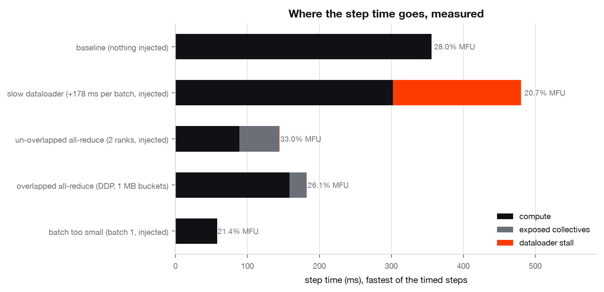

*Stacked step time for each diagnosed configuration, with end-to-end MFU
annotated. Source: [`results/diagnosis.json`](results/diagnosis.json).
Narrow-column version:
[`assets/step_breakdown_web.png`](assets/step_breakdown_web.png).*

| configuration | injected | what the tool said |
|---|---|---|
| baseline | nothing | worst recoverable finding: dataloader stall, **healthy, 0.0%** |
| slow dataloader | +178 ms per batch | **dataloader stall, critical, 37.1% of step, ranked 1 of 3** |
| un-overlapped all-reduce | 2 gloo ranks, all-reduce after backward | **exposed collective time, significant, 20.3% of step** |
| overlap vs no overlap | bucketed DDP | on 67.7 MB of identical gradient volume: manual loop 55.2 ms exposed and 0% overlapped, DDP at 25 MB buckets 27.1 ms and 19%, DDP at 1 MB buckets 23.8 ms and 31% |
| batch too small | batch 1 | **batch too small to saturate, critical, 64.3% of step, ranked 1 of 3** |

The control matters as much as the four positives. On the quiet configuration
the worst recoverable finding the tool reports is 0.0% of the step, so the four
detections above are not the tool firing on everything it is handed.

**The collective probe** ([`results/collectives.json`](results/collectives.json))
times four arms round robin, one step of each per iteration, so no arm gets its
own weather: 67,743,744 bytes of gradients across 52 tensors, gloo, two ranks,
env-based rendezvous exactly like `torchrun`. Step with no communication 216.2
ms; manual per-parameter all-reduce 271.4 ms; DDP at the default 25 MB cap 243.4
ms; DDP at a 1 MB cap 240.0 ms. Standalone references for the same call patterns
with nothing to hide behind: 33.7 ms flat, 33.2 ms per parameter, 34.6 ms in 1
MB chunks, i.e. 2.01 GB/s over loopback.

Two things the probe does **not** claim. Loopback TCP bandwidth says nothing
about InfiniBand or NVLink. And the difference between the two DDP bucket caps
is a few milliseconds, which is inside this machine's run-to-run spread while it
is shared, so the script asserts only what the measurement supports: the manual
loop hides none of its communication, and both bucketed arms expose at most half
of what it does.

The tool also refuses a cached MPS peak when the run is on CPU, rather than
dividing by the wrong denominator. Baseline MFU on CPU in that run was 28.0% of
the measured 0.275 TFLOP/s CPU peak, against a roofline ceiling of 97.7% for
that operator mix and shape.

---

## Part 4. The harness: checkpoints, failure and data

Full write-up with the reasoning behind each design decision:
**[`docs/CLUSTER.md`](docs/CLUSTER.md)**. Every measured number below is from
[`results/cluster.json`](results/cluster.json), written by `make cluster` in 28
seconds.

### Checkpoints that survive a change of layout

A job runs on 4 GPUs with 4-way tensor parallelism, each rank writing only its
own slice because gathering the model onto rank 0 means moving hundreds of
gigabytes to a single writer. Two weeks later it has to come back on 2 GPUs, or
8, or be evaluated in one process.
[`cluster/checkpoint.py`](src/transformer_internals/cluster/checkpoint.py) gives
every parameter a `ShardSpec`, writes one file per rank plus a self-describing
JSON index, and rebuilds rank *r* of a *new* world size reading only the source
shards that overlap the slice it is building.

Real GPT-2 124M, 149 tensors, fp32:

```
save under tp=4: 3420 ms, 4 shards of 397 MB, 1589 MB total
reshard 4 -> 1:   247 ms, 4 shard-file opens, bitwise identical: True
reshard 4 -> 2:   326 ms, 4 shard-file opens, bitwise identical: True
reshard 4 -> 8:  1073 ms, 8 shard-file opens, bitwise identical: True
logits after 4 -> 1 reshard: max abs diff 0, torch.equal: True
```

`torch.equal`, not `allclose`. Resharding moves bytes and computes nothing, so
any difference at all is a bug. The test matrix covers 4→2, 4→1, 2→8, 4→8, 8→4
and 1→4 and asserts exact logit equality in every direction.

**The detail that makes it a shard plan and not a byte-shuffle.** GPT-2's
`c_attn` is one `(3C, C)` matrix holding Q, K and V stacked along dim 0. Rank *r*
must own head-group *r* of Q **and** of K **and** of V. Splitting the matrix into
contiguous blocks does not do that: with 3 ranks, rank 0 would get all of Q and
none of K or V, and the model would still load, still run, and be silently
wrong. `ShardSpec.sections = 3` is what makes the split per-section, and a test
tags every row of the matrix with its projection and head and asserts each
rank's slice holds only whole heads of each of the three.

**The read pattern is asserted, not claimed.** Going 4→8 splits each source
shard in two, so a destination rank opens exactly one file. Going 4→2 opens two.
A full restore opens all four. Replicated tensors are read from a shard the rank
is already opening, so a 512-rank restore does not turn into 512 ranks
stampeding one file.

**Overlapped save.** `AsyncCheckpointer` snapshots to host memory on the
training thread and serialises on a background thread. The copy has to be
synchronous because the optimiser is about to overwrite those tensors in place;
the write does not. On a 25 MB state, three repeats: sync blocks the step for
42.3 ms, async blocks it for 2.3 ms and spends 42.6 ms on the background thread.
The step-time ratio was 13.7x, 22.1x and 14.5x across the three, and it moves
that much because the synchronous arm is at the mercy of the page cache. The
test asserts only the direction.

**A constraint worth naming.** GPT-2's vocabulary is 50257 entries, which does
not divide by 4, so a vocabulary-parallel embedding cannot be split four ways.
`split_tensor` refuses rather than padding behind your back. This is exactly why
Megatron-LM has `--make-vocab-size-divisible-by 128`.

### Killing a rank and getting the run back

[`cluster/failure.py`](src/transformer_internals/cluster/failure.py) runs a real
multi-process job: one OS process per rank with `RANK`, `WORLD_SIZE`,
`MASTER_ADDR` and `MASTER_PORT` in the environment, which is the contract
`torchrun` has with its workers, gloo, `DistributedDataParallel`, checkpoints
every 5 steps. The launcher sends a real `SIGKILL` to rank 1 with no unwinding
and no chance to flush, tears down the survivors, and relaunches from the last
checkpoint.

The assertion is not "the loss still goes down". The same job runs twice, once
uninterrupted and once with rank 1 killed at step 12 when the last checkpoint
was step 10, and the two loss trajectories are compared step by step:

```
killed rank 1 at step 12, checkpoint was step 10, recovered in 2.20s, launches 2
max |loss(resumed) - loss(uninterrupted)| over steps 11-20 = 0.000e+00
```

Zero, not "small". Three things have to be in the checkpoint for that to hold
and all three are: parameters, optimiser state including Adam's two moments and
its step count, and the dataloader position for every rank. Restoring weights
but not moments restarts the bias correction and puts a visible bump in the loss
for a few hundred steps, which is the kind of bug that survives review because
the curve still goes down.

Time-to-recover here is 2.20 s and almost all of it is process startup and
importing torch. On a real job that interval also contains the scheduler
noticing, requeueing, allocating replacement nodes and re-reading a checkpoint
of hundreds of gigabytes over the storage fabric: minutes, not seconds. The
structure of the measurement is the same, and the clock starts when the rank
dies and stops when the first optimiser step lands after the restart.

### Streaming data that resumes correctly

[`cluster/streaming.py`](src/transformer_internals/cluster/streaming.py). One
global order per epoch, seeded from `(seed, epoch)` so every rank computes it
without communicating; rank *r* of *W* takes positions `r, r+W, r+2W, ...`. A
strided deal rather than contiguous blocks, deliberately: contiguous blocks give
each rank one long region of the corpus, so a rank that draws a region of short
documents runs ahead and every step is set by the slowest rank for the whole
epoch.

The position within the epoch, per rank, is part of the checkpoint. Resuming at
the top of the epoch is the most common data bug in a restartable trainer and it
is invisible: nothing errors, the loss curve looks normal, and the model quietly
sees a fraction of the corpus many times and the rest never. Resuming is
replanning rather than seeking, so coverage stays exactly once even when the
world size has changed, which is what makes elastic restart safe.

**Prefetch, measured in both regimes.** Prefetch is usually presented as free
throughput. It is not. One rank of two, 256-token samples, best of three:

| prefetch depth | page-cached memmap, no consumer work | 500 µs reads + 500 µs step |
|---:|---:|---:|
| 0 | 117,055 samples/s | 708 samples/s |
| 2 | 25,523 samples/s | 1,354 samples/s |
| 8 | 59,969 samples/s | 1,356 samples/s |

Against a file already in the page cache a read is a memcpy and the reader
thread is pure overhead, so prefetch costs a factor of two to four. Against
storage that takes 500 µs a read, with a consumer that takes 500 µs a sample,
prefetch 8 is **1.92x** faster against a ceiling of exactly 2.00x, because when
the read and the step cost the same, perfect overlap halves the total. The right
depth is the one that covers the jitter in read latency for *this* storage.

### The launchers

In [`deploy/`](deploy), with the reasoning inline. Four schedulers, one job.
None of these were run against a real cluster, because there is no cluster here;
they are written to be read by someone who runs one.

- **Slurm** ([`slurm_train.sbatch`](deploy/slurm_train.sbatch)). One task per
  GPU, `--gres-flags=enforce-binding` so the CPU cgroup follows the GPU's NUMA
  node, `srun` starting one `torchrun` per node. Two layers, because a transient
  rank failure is `torchrun`'s job and a dead node is Slurm's. `--requeue` plus
  `--signal=B:USR1@180` gives the job three minutes to checkpoint before the
  wall clock expires. The NCCL block names the HCAs and the socket interface
  explicitly: letting NCCL choose is how a job ends up bootstrapping over the
  management NIC or a `docker0` bridge at a twentieth of the expected bandwidth.
- **Ray** ([`ray_train.py`](deploy/ray_train.py)). `TorchTrainer` with
  `FailureConfig(max_failures=3)` and checkpoints reported through
  `ray.train.report` so the driver, which outlives the workers, still holds them
  after every worker has died. The line that matters is
  `placement_strategy="STRICT_PACK"`: Ray schedules by resource request and has
  no idea what NVLink is, so a tensor-parallel group will be spread across four
  machines unless you say otherwise, and nothing will error.
- **Kubernetes** ([`k8s/job-indexed.yaml`](deploy/k8s/job-indexed.yaml),
  [`k8s/statefulset.yaml`](deploy/k8s/statefulset.yaml)). An Indexed Job for the
  stable node rank, a headless Service for the rendezvous DNS name, `/dev/shm`
  sized explicitly because the 64 MB container default kills DataLoader workers
  and NCCL's shared-memory transport with a bus error minutes into the run,
  affinity rules that pin the pods into one topology block because Kubernetes
  spreads across failure domains by default, requests equal to limits for
  Guaranteed QoS, and `CAP_IPC_LOCK` so RDMA can pin its memory regions.
- **Dask** ([`dask_note.md`](deploy/dask_note.md)). Not in the training loop, on
  purpose: a dynamic work-stealing scheduler is the opposite of what a
  synchronous collective needs. It belongs in corpus preparation.

**cgroups** ([`cluster/cgroups.py`](src/transformer_internals/cluster/cgroups.py),
[`deploy/cgroups_demo.sh`](deploy/cgroups_demo.sh)). Every scheduler enforces its
limits through cgroups, and nothing the process sees with `free` or `nproc`
reflects them. The demo runs the reader in Docker under a 512 MiB limit and 1.5
CPUs, then allocates past the limit; the captured output is
[`deploy/cgroups_demo_output.txt`](deploy/cgroups_demo_output.txt) and it ends:

```
allocated 448 MiB
### exit code: 137
```

No traceback and no `MemoryError`. 137 is 128 + SIGKILL: the cgroup OOM killer
took the process. **This is why an out-of-memory rank looks like a node failure
rather than an exception**, and why `memory.events`' `oom_kill` counter is the
first thing to read after an unexplained rank death. `memory.high` and `cpu.max`
do not kill at all; they throttle, and "the run is at 30% of expected
throughput" is what that looks like from outside. The demo also tried to show
the swapping case and could not, which is worth recording: raising the cgroup's
swap allowance changed nothing because the kernel had no swap device
(`SwapTotal: 0 kB`). `memory.swap.max` is permission, not capacity.

### The interconnect cost model

**Everything in this section is MODELLED.**
[`cluster/fabric.py`](src/transformer_internals/cluster/fabric.py) computes ring
collective times as `latency + bytes/bandwidth` from published peak
bandwidths, each carrying its source in the code: NVLink 4 at 450 GB/s per
direction (H100 datasheet, 18 links x 25 GB/s; NVIDIA quotes 900 GB/s
bidirectional aggregate and a ring gets one direction), PCIe Gen5 x16 at 63
GB/s, InfiniBand NDR400 at 50 GB/s per GPU (DGX H100, 8 ConnectX-7 NICs), RoCE
over 200 GbE at 25 GB/s. Link efficiency 0.85 and MFU 0.45 are labelled
assumptions, not citations.

70B-class model, 8k context, 64 H100s as tp=8 x dp=8. Modelled compute
**8533.1 ms** per step; communication in ms, and as a fraction of that compute:

| strategy | nvlink4 | pcie5 | ib_ndr | roce200 |
|---|---|---|---|---|
| tensor parallel | 1643.7 (0.19x) | 11407.9 (1.34x) | 14219.8 (1.67x) | 28475.5 (3.34x) |
| FSDP | 114.2 (0.01x) | 815.4 (0.10x) | 1027.3 (0.12x) | 2054.6 (0.24x) |
| DDP | 76.1 (0.01x) | 543.6 (0.06x) | 684.9 (0.08x) | 1369.7 (0.16x) |

**The conclusion, which is arithmetic rather than tradition.** Read the tensor
parallel row across. It moves 2560 all-reduces of 134 MB per step, because it
communicates per layer, per microbatch, in both directions, and its volume
scales with tokens rather than parameters. On NVLink that is 0.19x the compute
time and hides under it. On InfiniBand NDR it is 1.67x the compute time, so the
GPUs would spend most of the step idle. On the same fabric, tensor parallelism
costs **13.8x what FSDP costs per step**. That ratio is why tensor parallelism
lives inside the NVLink domain and sharded data parallelism crosses the
InfiniBand fabric. The crossover degrees fall out of the same model: tensor
parallelism becomes communication-bound at tp=64 on NVLink 4, tp=8 on InfiniBand
NDR, and tp=4 on RoCE. The standard layout is where those two curves cross.

Turning GPUDirect RDMA off, modelled as a 1.6x bandwidth penalty and +5 µs,
takes the InfiniBand tensor-parallel row from 14219.8 ms to 22887.9 ms (1.61x).
Without GPUDirect a tensor leaving GPU 0 on node A crosses PCIe to a host bounce
buffer, crosses PCIe again to the NIC, and does the reverse on the far side, with
the CPU in the data path so the latency floor becomes a kernel round-trip. Two
operational notes the model does not capture: RDMA must pin the memory it
registers, so a container without `CAP_IPC_LOCK` fails registration and NCCL
falls back to TCP with nothing in the logs but `via NET/Socket` under
`NCCL_DEBUG=INFO`; and on RoCE the same verbs need PFC/ECN configured or the
fabric connects and then behaves like a congested network.

**Validating the shape of the model.** The H100 numbers cannot be checked here.
The functional form can.
[`cluster/collbench.py`](src/transformer_internals/cluster/collbench.py) measures
gloo all-reduce on this machine across message sizes and fits the same affine
form with the same `2(N-1)/N` ring factor. **MEASURED**, 2 ranks, CPU, loopback,
64 KiB to 4 MiB:

```
t = 408 us + bytes / 3.16 GB/s     R^2 = 0.9911
```

Repeated runs gave 180 µs / 2.95 GB/s, 408 µs / 3.16 GB/s, 450 µs / 3.85 GB/s
and 474 µs / 1.97 GB/s. The fitted constants move with the machine's load; R²
stayed above 0.99 every time, and R² is the claim. The 2-4 GB/s is loopback TCP
plus a memory copy, not a fabric, and means nothing beyond this machine. Below
about 64 KiB the fit degrades badly, which is the model's own point: small
messages are latency, not bandwidth, and that is the regime where GPUDirect and
the hop count decide everything.

### Three collectives, in bus bandwidth, across world sizes

The all-reduce fit above is one collective at one world size. The full sweep is
in [`results/collective_bandwidth.json`](results/collective_bandwidth.json),
written by `make collectives`. All-reduce, all-gather and reduce-scatter, over
message sizes from 16 KB to 256 MB, at world sizes 2 and 4, reported in **bus
bandwidth**: algorithm bandwidth times the ring factor for the collective, with
the size taken as the full unsharded buffer in every case. That is NCCL's own
convention, and it is the one that makes three different collectives comparable,
because it is flat in the world size where algorithm bandwidth is not.

**MEASURED**, gloo over TCP loopback on this machine, 20 timed calls per point:

| ranks | collective | peak bus GB/s | fitted GB/s | fitted latency | R² |
|---|---|---|---|---|---|
| 2 | all-reduce | 3.101 | 2.923 | 143.8 µs | 0.9991 |
| 2 | all-gather | 2.056 | 2.071 | 143.8 µs | 0.9999 |
| 2 | reduce-scatter | 1.237 | 1.193 | 143.9 µs | 0.9996 |
| 4 | all-reduce | 1.890 | 1.939 | 1400.7 µs | 0.9999 |
| 4 | all-gather | 1.682 | 1.717 | 623.2 µs | 0.9999 |
| 4 | reduce-scatter | 0.784 | 0.799 | 1122.7 µs | 0.9999 |

Two things fall out of it, and neither was put there on purpose.

**The latency term is the same for all three collectives at world size 2**:
143.8, 143.8, 143.9 µs. It is a per-call fixed cost, not a per-collective one,
which is what an affine model of a collective assumes and is not obliged to be
true.

**Reduce-scatter is the slowest of the three, and by the amount gloo's
implementation predicts.** `comms.py` has said since it was written that gloo has
no native ring reduce-scatter and that PyTorch services the call as an all-reduce
followed by a slice. If that is right, reduce-scatter takes an all-reduce's time
while being charged half an all-reduce's ring factor, so its bus bandwidth should
be half: `2.923 / 2 = 1.46 GB/s`. Measured: **1.193**, which is the right kind of
number and 18% below it, the gap being the slice copy. A docstring claim became a
measurement.

**The cost model, priced against the measurements it was fitted to.** Turning the
fit into a `Link` and evaluating `all_reduce_time` at every point in the sweep
(world size 4, all-reduce):

| bytes | measured | modelled | modelled/measured |
|---|---|---|---|
| 16,384 | 1.665 ms | 1.413 ms | 0.85 |
| 65,536 | 1.275 ms | 1.451 ms | 1.14 |
| 262,144 | 1.267 ms | 1.603 ms | 1.27 |
| 1,048,576 | 2.367 ms | 2.212 ms | 0.93 |
| 4,194,304 | 4.552 ms | 4.645 ms | 1.02 |
| 16,777,216 | 14.636 ms | 14.378 ms | 0.98 |
| 67,108,864 | 53.250 ms | 53.309 ms | 1.00 |

The model was fitted to these points, so this is a check on its *form* and not a
held-out prediction. The reading that matters is where it fails: within 2% on the
four largest messages, and out by 27% at 262 KB, which is the latency-dominated
end where the real cost is scheduling rather than either term. That failure is
the model's own point, and it is the regime where GPUDirect and the hop count
decide everything.

One implementation detail worth stating because getting it wrong is invisible:
`Link.latency_us` is a **per-hop** latency, and the intercept of a fit to
whole-collective times is not. Dividing by the `2(n-1)` ring hops is the
difference between the table above and one that overpredicts every small message
by six times.

---

## The rest of the repository: the model everything above runs on

Everything above stands on a GPT-2 implementation that was verified before any
of it was measured. That order matters: when a sharded implementation disagrees
with a single process by 1.9e-06, it is the sharding, because the model itself
was already pinned against a known-good reference.

Verifying it was its own problem. The usual demonstration of "I built GPT-2 from
scratch" is a small model trained on Shakespeare, a loss curve that goes down,
and some generated text, and that proves nothing. A subtly wrong attention mask
still produces plausible text and a decreasing loss. So does a transposed
projection, an off-by-one in the KV cache, the wrong GELU, or a tokenizer that
segments differently from the real one. Every one of those bugs is invisible to
the demonstration that is usually offered as evidence, so this half of the
repository loads the published OpenAI weights and proves equivalence against
HuggingFace instead.

**This is also the second half of the interview question.** A training harness
that runs fast and never crashes is worth nothing if the model it is training is
subtly wrong, and a wrong model looks exactly like a right one from the outside.

---

## Part 5. The implementation

Pure PyTorch. No `transformers` modelling code, no `nn.MultiheadAttention`, and
no `F.scaled_dot_product_attention` on the reference path: the q/k/v projection,
the head reshape, the scaled dot product, the causal mask, the softmax and the
output projection are all written out in
[`src/transformer_internals/model.py`](src/transformer_internals/model.py) so
they can be read and checked line by line. (`scaled_dot_product_attention` is
available behind a config flag as a speed arm, and a test asserts the two agree.)

- **Byte-level BPE** implemented from scratch: the byte↔unicode bijection, the
  regex pre-tokenizer, and rank-ordered merges, verified to produce *identical
  token ids* to the reference on emoji, CJK, Cyrillic and control bytes.
  Round-tripping alone would not be enough: a tokenizer can be losslessly wrong.
- Token + learned positional embeddings, weight tying, pre-LayerNorm blocks,
  GPT-2's tanh-approximated GELU, and the `0.02/sqrt(2·n_layer)` residual init.
- **KV cache** with per-layer state, plus greedy, temperature, top-k and top-p
  sampling.
- **Grouped-query and multi-query attention** (`n_kv_head`), which shrink the
  cache by exactly `n_head / n_kv_head`.
- Training loop with AdamW, cosine schedule with warmup, gradient clipping,
  gradient accumulation, and decay applied only to matmul weights.

Every parameter shape is checked against the published model:
`num_parameters() == 124,439,808`, asserted in
[`tests/test_model.py`](tests/test_model.py).

---

## Part 6. Verification

This is the headline. The published OpenAI GPT-2 124M weights are loaded into
this implementation, and it is proven to compute the same function as
HuggingFace's `GPT2LMHeadModel`. `transformers` is used *only* to fetch the
checkpoint and as the oracle; it is never on the forward path under test.

Four levels of evidence, each strictly harder to pass than the last.

| Level | What is checked | Result |
|---|---|---|
| **1. Activations** | every sub-module of every block, on a fixed batch | worst **7.63e-05** (`h.11.attn`), against activations of scale up to 3.0e+03 |
| **2. Final logits** | max abs difference, asserted in a test | **6.10e-05**, tolerance 1e-03 |
| **3. Greedy generation** | token-exact, 300 tokens, 5 prompts | **all 5 exact**, 1500 consecutive argmax agreements |
| **4. Perplexity** | held-out slice, both implementations | **19.5673** vs **19.5673**, differing by 1.2e-06 over 4,096 tokens |

Run it with `make verify`; the numbers above are read from
[`results/verification.json`](results/verification.json).

**Why 1e-03 and not zero.** These are floating-point computations, not symbolic
ones. We compute `(q @ kᵀ) / sqrt(d)` where the reference computes
`(q @ kᵀ) * (1/sqrt(d))`; our GELU is a different expression tree; matmul
reductions block differently. The observed error grows with depth exactly as
accumulated fp32 rounding should, visible in the headline figure, and lands at
6.1e-05 on logits whose own scale is ~1.7e+02, i.e. a relative error near 1e-06.
A bit-exact assertion would be the wrong test: it would fail on hardware that is
perfectly correct.

**The suite is shown to reject a wrong model.** A verification suite that has
never rejected anything is not evidence, so
[`tests/test_verification.py`](tests/test_verification.py) includes a negative
control: transposing *one* square projection. This is the classic bug that survives
because 768×768 still multiplies, must push the logits outside tolerance and
break token-exact generation. It does.

### Two real bugs this caught

Both would have passed a loss-curve-and-samples demonstration.

1. **The KV cache read its offset from layer 0.** `cache.seq_len` looked at
   layer 0's stored keys, which layer 0 had *already updated* for the current
   step. So every layer after the first computed `past_len` too large by `T` and
   sliced its causal mask at the wrong position. The model still produced fluent
   English. The cached-vs-uncached equality test caught it immediately.
2. **The loader silently dropped the qkv bias.** The ignore-list matched the
   suffix `attn.bias`, which also matches `attn.c_attn.bias`. The model loaded
   without error, ran, and generated text, with no query/key/value bias in any
   block.

---

## Part 7. Using it as an instrument

### What each design decision is worth

Nine configurations, each changing exactly one field against a shared baseline,
all trained under an identical budget with identical data order and **three
seeds**. Reported as mean ± standard deviation of final validation loss.

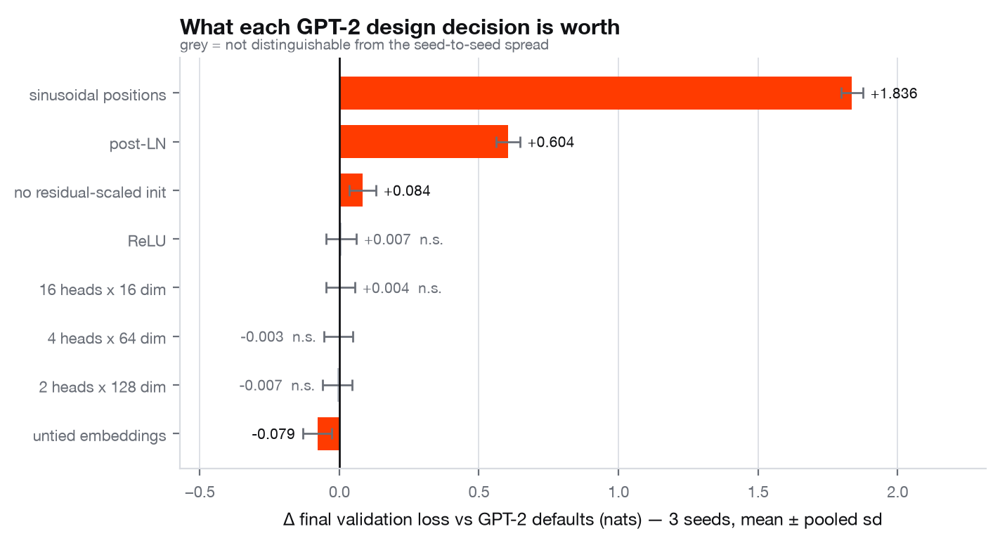

*Source: [`results/ablations.json`](results/ablations.json). Narrow-column
version: [`assets/ablations_web.png`](assets/ablations_web.png).*

| Configuration | Val loss (3 seeds) | Δ vs baseline | Verdict | s/run |
|---|---|---|---|---|
| GPT-2 defaults | 4.0226 ± 0.0362 |, | reference | 44.7 |
| sinusoidal positions | 5.8588 ± 0.0148 | **+1.8362** | worse | 36.6 |
| post-LN | 4.6267 ± 0.0216 | **+0.6041** | worse | 40.0 |
| no residual-scaled init | 4.1063 ± 0.0308 | **+0.0837** | worse | 35.5 |
| ReLU instead of GELU | 4.0298 ± 0.0399 | +0.0072 | *indistinguishable* | 28.2 |
| 16 heads × 16 dim | 4.0265 ± 0.0370 | +0.0039 | *indistinguishable* | 43.3 |
| 4 heads × 64 dim | 4.0194 ± 0.0365 | −0.0032 | *indistinguishable* | 49.2 |
| 2 heads × 128 dim | 4.0160 ± 0.0376 | −0.0067 | *indistinguishable* | 42.5 |
| untied embeddings | 3.9439 ± 0.0362 | **−0.0787** | better | 37.2 |

*6 layers, 256 wide, 250 steps, TinyStories. "Indistinguishable" means
`|Δ|` did not exceed the pooled seed-to-seed standard deviation, a deliberately
conservative bar, stated once in the code so it cannot drift.*

Three findings worth stating plainly:

- **Head count, at fixed parameter count, did not matter.** 16×16, 8×32, 4×64 and
  2×128 are the same model size and the same FLOPs, and all four land inside one
  standard deviation of each other. This is a null result and it is reported as
  one. At this scale and budget, how the residual stream is partitioned into
  heads is not what is limiting the model.
- **GELU vs ReLU was also indistinguishable** (+0.007 against a spread of 0.040).
- **Untying the embeddings *helped*** (−0.079). That is the opposite of the usual
  telling, and it is not mysterious: untying adds 1.0M parameters to a 5.8M-parameter
  model, and at this scale the extra capacity is worth more than the
  regularisation tying provides. It is a reminder that GPT-2's choices were made
  at GPT-2's scale.

The two decisions that mattered enormously, learned positions and pre-LN, are
both about **how information moves through depth**, not about capacity.

### Finding induction heads

An **induction head** implements `[A][B] … [A] → [B]`: having seen a bigram, it
predicts the continuation when the first token recurs. Olsson et al. (2022)
identify it as a mechanism behind in-context learning. The prediction is
falsifiable and completely specific: on random tokens repeated twice, such a head
at position `i` must attend to position `i − (T−1)`.

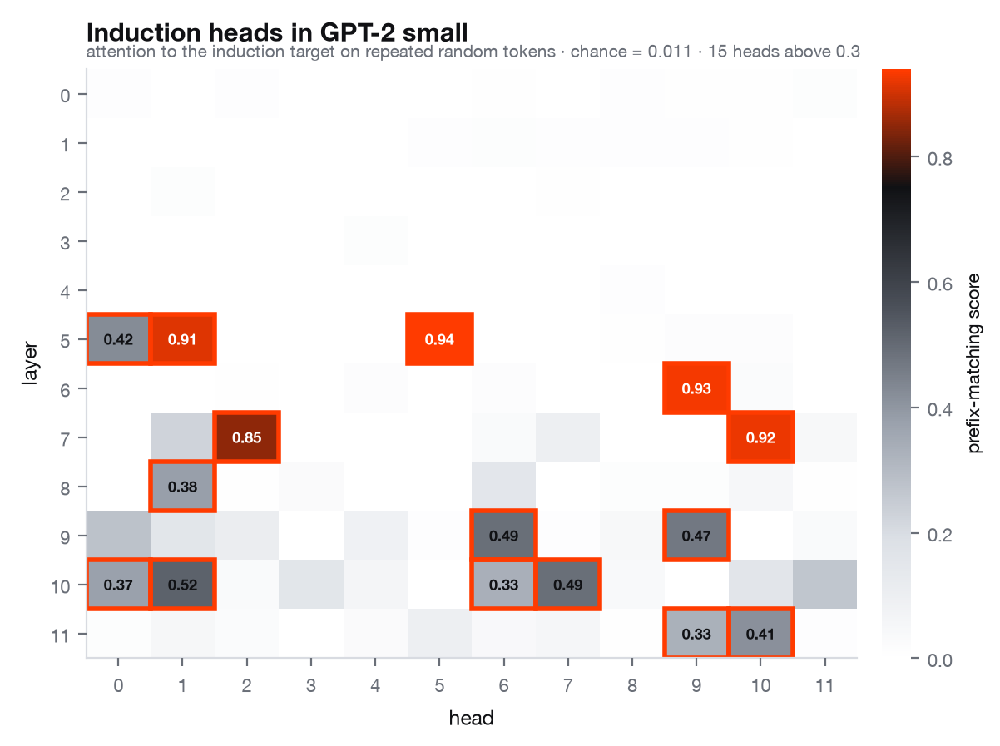

*Per-head prefix-matching score on `[BOS] X X` with `X` a 60-token random
sequence. Chance is 0.011. Source:
[`results/induction.json`](results/induction.json).*

**The induction heads in GPT-2 small are L5H5, L6H9, L7H10, L5H1 and L7H2**, scoring 0.94, 0.93, 0.92, 0.91 and 0.85 against a chance level of 0.011, i.e.
~80× chance. The other half of the circuit is also visible: the strongest
**previous-token head is L4H11 at 0.99**, sitting below the induction heads, which
is exactly the ordering the circuit requires in order to compose.

Behaviourally, the mechanism does what it claims: on the repeated sequence, the
model's loss falls from **12.262 nats on the first copy to 0.365 on the second**, an induction bump of 11.9 nats on tokens that are, by construction,
unpredictable.

Two honest negatives:

- **The copying score works, but it does not select the induction heads.**
  Passing token embeddings through a head's OV circuit `W_U W_O W_V W_E` and
  asking how often the token's own identity comes out on top does find a real and
  distinct population of copying heads, **L11H3 (0.639), L11H10 (0.605), L7H8
  (0.552)**, with 17% of all heads above 0.1 against a median of 0.001. But all
  five prefix-matching heads score essentially zero on it (L5H5: 0.008, L7H2:
  0.000). Folding the LayerNorm gains into the circuit does not rescue the
  induction heads, they stay at **0.005 or below**, though it does move
  individual heads by up to 0.426 and shifts the ranking (rank correlation
  0.879), so it is a real refinement rather than a no-op. Both versions are
  computed and committed (`copying`, `copying_ln_folded` in
  [`results/induction.json`](results/induction.json)). The construction only sees
  the *direct* path to the unembedding, whereas an
  induction head writes into a residual stream that later layers read and
  transform, so "attends to the right place" and "copies via its own direct
  path" turn out to be nearly disjoint properties in GPT-2 small. The one head
  scoring highly on both is **L11H10** (prefix 0.414, copying 0.605).
- **Attending to the right place is not the same as mattering.** Zeroing each
  head in turn and measuring the damage to second-copy loss gives a *different*
  ranking: the most damaging heads are **L0H0 (+0.81 nats)** and **L1H10
  (+0.42)**, which have near-zero prefix-matching scores, they are upstream of
  the circuit. Only **L5H1 (+0.41)** appears near the top of both lists. The
  attention pattern identifies the mechanism; only ablation shows it is used.

---

## Part 8. Inference efficiency

### The KV cache, measured rather than asserted

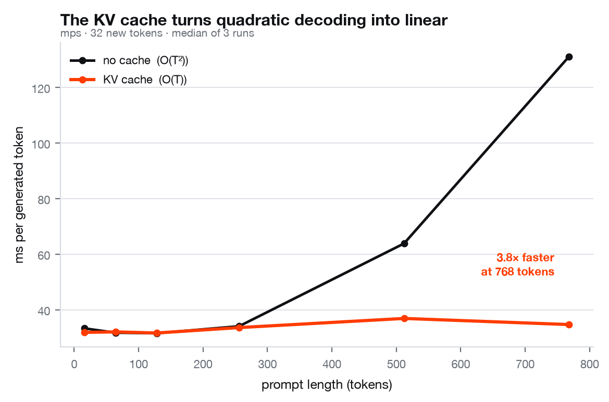

*Source: [`results/kv_cache.json`](results/kv_cache.json), Apple M-series MPS,
32 new tokens, median of 3 runs.*

| Prompt length | no cache (ms/token) | KV cache (ms/token) | Speedup |
|---|---|---|---|
| 16 | 33.29 | 31.85 | 1.05× |
| 64 | 31.74 | 32.03 | 0.99× |
| 128 | 31.53 | 31.63 | 1.00× |
| 256 | 34.06 | 33.58 | 1.01× |
| 512 | 63.84 | 36.87 | **1.73×** |
| 768 | 131.09 | 34.67 | **3.78×** |

The cached arm is **flat**, ~32 ms per token regardless of context, the signature
of O(1) per-token work, though only 3 repeats were taken and the run-to-run spread
reaches 40% of the median at the longest prompt, while the uncached arm grows
linearly per token and
therefore quadratically in total. **The crossover is around 256–512 tokens**: below
that the cache buys nothing on this hardware, because the per-step overhead of
concatenating and writing cache tensors is the same order as the work it saves.
The usual claim that a KV cache is a strict win is only true past that point.

### Cache memory is the number that decides serving capacity

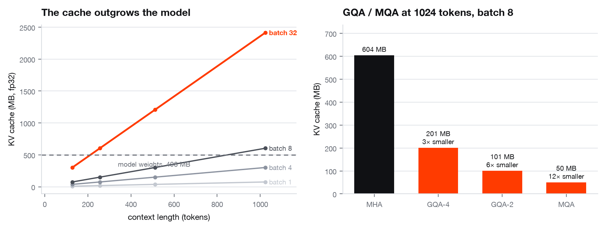

GPT-2 124M in fp32 stores **73,728 bytes of cache per token per sequence**
(`2 × 12 layers × 12 heads × 64 dims × 4 bytes`). The analytic formula was checked
against the actually-allocated tensors and matches exactly (ratio 1.0000).

| Context | Batch | Cache | vs model weights (497.8 MB) |
|---|---|---|---|
| 1024 | 1 | 75.5 MB | 0.15× |
| 1024 | 8 | 604.0 MB | **1.21×** |
| 512 | 32 | 1208.0 MB | 2.43× |
| 1024 | 32 | 2415.9 MB | **4.85×** |

At batch 8 and full context the cache is already larger than the model. This is
why modern models use grouped-query attention, and the saving is exact:

| Variant | KV heads | Cache @1024×8 | Reduction |
|---|---|---|---|
| MHA (GPT-2) | 12 | 604.0 MB | 1× |
| GQA-4 | 4 | 201.3 MB | **3×** |
| GQA-2 | 2 | 100.7 MB | **6×** |
| MQA | 1 | 50.3 MB | **12×** |

Both variants are implemented (`n_kv_head`), and the cache stores the
*unexpanded* keys and values, expanding before caching would pay the quality
cost while throwing away the entire memory win.

### Quantization: the granularity of the scale is the whole story

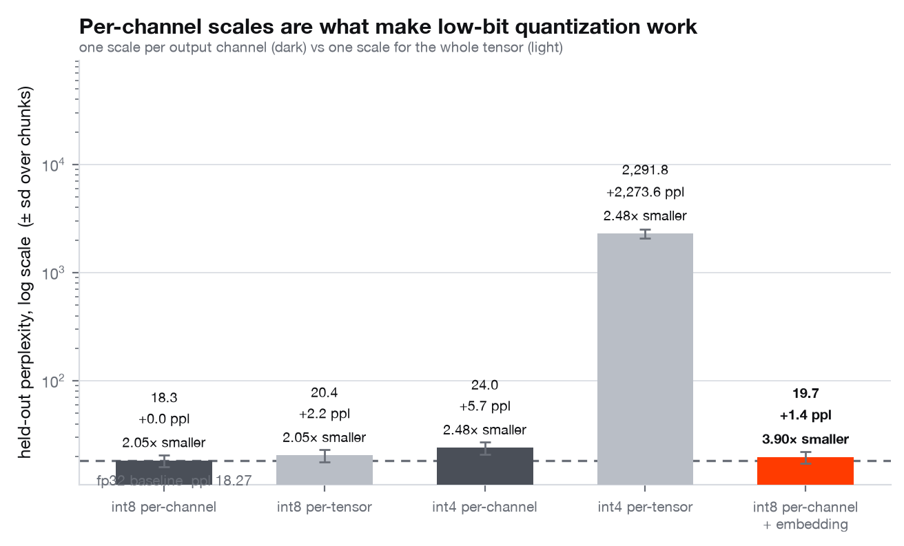

*Symmetric linear quantization implemented directly (`quantize_tensor`,
`pack_int4`). Sizes are real files on disk, int4 codes are genuinely packed two
per byte. Source: [`results/quantization.json`](results/quantization.json).*

> The fp32 perplexity differs between sections, 19.57 in the verification
> table, 18.27 here, 18.74 on the frontier below, because each experiment scores
> its own held-out slice (4,096 / 8,192 / 6,144 tokens). Comparisons are only ever
> made *within* a section, and the frontier re-scores every configuration itself
> for exactly this reason.

| Scheme | Perplexity | Paired Δ loss (nats, ±2 s.e.) | On disk | Compression |
|---|---|---|---|---|
| fp32 reference | 18.27 |, | 497.8 MB | 1.00× |
| int8 per-channel | 18.31 | **+0.0019 ± 0.0008** | 243.4 MB | 2.05× |
| int8 per-tensor | 20.44 | +0.1122 ± 0.0088 | 243.0 MB | 2.05× |
| int4 per-channel | 24.01 | +0.2732 ± 0.0167 | 200.9 MB | 2.48× |
| int4 per-tensor | **2291.84** | +4.8317 ± 0.0748 | 200.6 MB | 2.48× |
| int8 per-channel + embedding | 19.68 | +0.0741 ± 0.0051 | 127.8 MB | **3.90×** |

The Δ column is the **paired** per-chunk loss change: every scheme is scored on
the same 8 chunks, so the chunk-to-chunk variation is common to both arms and
cancels. That matters, the unpaired spread of perplexity across chunks is ±2.35,
which is larger than four of these five effects and would have hidden all of them.

With 8 paired chunks the test resolves shifts of ~0.001 nats, so *every* scheme
here is statistically distinguishable from fp32, **int8 per-channel included**.
Statistical and practical significance are different questions: int8 per-channel
costs +0.0019 nats, which is +0.03 perplexity on a baseline of 18.27, detectable,
and negligible. The table reports both numbers so a reader can apply their own
threshold; the highlighted row uses a stated one (0.01 nats, ≈1% perplexity).

**Per-channel scaling is what makes the bit width usable.** At 8 bits, moving from
per-channel to a single per-tensor scale costs **59× more** (+0.1122 vs +0.0019
nats). At 4 bits it stops being a tradeoff and becomes a cliff: per-channel
degrades gracefully to perplexity 24.0, **per-tensor collapses to 2291.8**, one
outlier weight sets the step size for the entire matrix and everything else
quantizes to near-zero.

Note the compression ratios: int8 only reaches 2.05×, not 4×, because the 38.6M-parameter
embedding stays in fp32. Quantizing it too reaches 3.90× for +1.41
perplexity, and under weight tying that tensor is also the output head, which is
why it is the most sensitive one in the model.

**On speed:** these are *simulated* quantization measurements, weights are
quantize-dequantized, so the forward pass computes exactly what a real integer
kernel would compute from the same weights, but runs at fp32 speed. PyTorch 2.2
ships no int4 kernel and no int8 MPS kernel, so a tokens/sec speedup cannot be
measured here honestly, and none is claimed. The quality and size numbers are
real and hardware-independent.

### Structured pruning

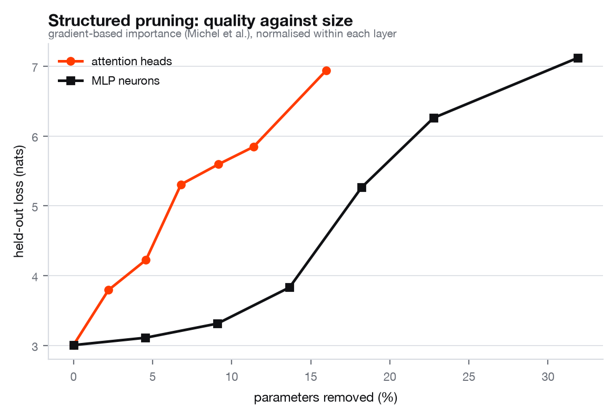

Heads and MLP neurons are ranked by `|∂L/∂ξ|`, the gradient of the loss with
respect to a multiplicative mask held at 1 (Michel et al., 2019), normalised
within each layer, then pruned globally. Structured, not unstructured: removing a
whole head or neuron removes whole rows and columns, so the FLOPs actually go
away.

| Sparsity | Heads: params removed → loss | Neurons: params removed → loss |
|---|---|---|
| 0% | 0.0% → 3.0042 | 0.0% → 3.0042 |
| 10% | 2.2% → 3.7932 | 4.6% → 3.1098 |
| 20% | 4.6% → 4.2250 | 9.1% → 3.3130 |
| 30% | 6.8% → 5.3066 | 13.7% → 3.8307 |
| 50% | 11.4% → 5.8450 | 22.8% → 6.2595 |

**MLP neurons prune far more gracefully than attention heads.** Removing 9.1% of
parameters as neurons costs 0.31 nats; removing 4.6% as heads costs 1.22 nats. **Half as many parameters removed, four times the damage**. GPT-2 small does not
have redundant heads to spare.

**Tying this back to the induction result.** Pruning heads destroys induction
behaviour quickly: second-copy loss on the repeated-sequence probe rises from
0.378 (unpruned) to **3.69 at 10% head sparsity** and 17.80 at 70%. (This probe
uses 4 sequences; the 0.365 quoted earlier uses 8, which is why the two unpruned
baselines differ slightly, they are the same measurement at different batch
sizes.) And the
gradient criterion, which ranks heads by their contribution to *language-modelling*
loss, correlates only **+0.11 (Spearman)** with direct-ablation damage to
*induction*. Those are two different notions of importance, and a pruning
criterion optimised for one will happily delete the heads that carry the other.

### Distillation

The same 4-layer student trained twice under an identical budget with identical
batches, once on hard labels, once against the verified teacher's distribution,
with α swept, on CPU, because this experiment needs the full 50257-token
vocabulary and that is exactly where MPS stops being reproducible (see below).

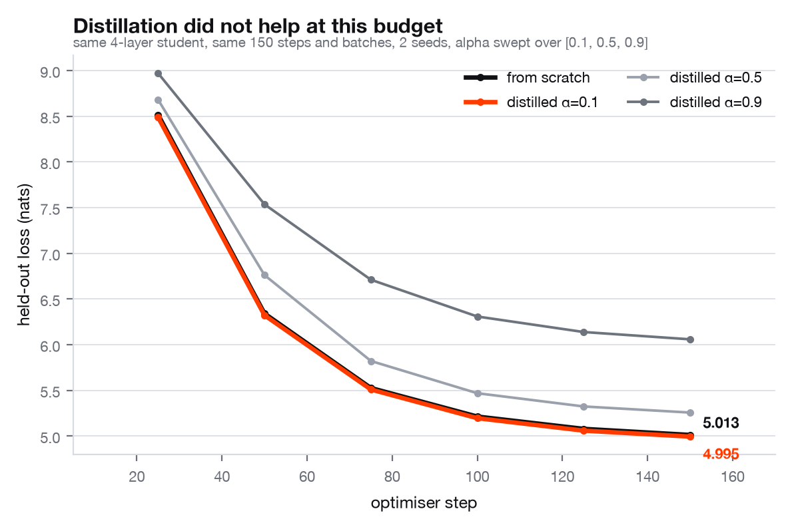

| Arm | Val loss (2 seeds) | Δ vs from-scratch | Verdict | s/run |
|---|---|---|---|---|
| from scratch | 5.0130 ± 0.0231 |, | reference | 68 |
| distilled α=0.1 | 4.9946 ± 0.0208 | -0.0184 | *indistinguishable* | 177 |
| distilled α=0.5 | 5.2576 ± 0.0258 | +0.2446 | worse | 175 |
| distilled α=0.9 | 6.0593 ± 0.0020 | +1.0463 | worse | 167 |

*Source: [`results/distillation.json`](results/distillation.json). 4-layer,
256-wide student, 150 steps, full 50257-token vocabulary shared with the teacher.*

**Distillation did not help at this budget.** The best arm (α=0.1) finishes
0.0184 nats below the control, against a pooled standard deviation
of 0.0311, inside the noise, so *indistinguishable*. Raising α makes
it monotonically worse: at α=0.9, where the soft targets dominate the hard
labels, the student is 1.05 nats behind. And it costs **2.6× the
wall-clock**, because every step runs a 124M-parameter teacher forward to train a
16.1M-parameter student. (The student is larger than the ablation models because
it must share the teacher's full 50257-token vocabulary, 12.9M of its parameters
are the embedding alone.)

This is a negative result at a small budget, not a refutation of distillation.
150 steps is far too few for a student to exploit the teacher's distribution,
and the teacher itself is only moderately good on this corpus. What the
experiment does establish is the methodology: identical student, identical
batches, identical seeds, α swept rather than chosen, and the cost reported next
to the quality.

### The frontier

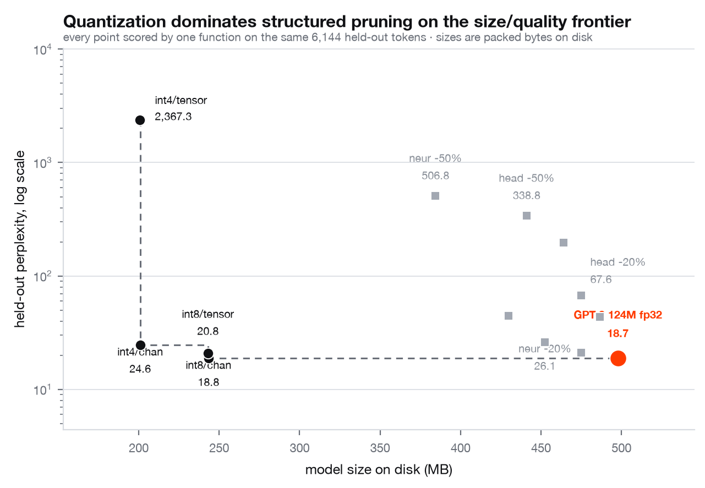

*Every configuration re-scored by one function on the same
6,144 held-out tokens, so the points are actually
comparable. The other scripts each use their own evaluation slice, and putting
those numbers on one chart would be a quiet apples-to-oranges comparison. Source:
[`results/pareto.json`](results/pareto.json).*

**No pruning configuration is on the Pareto front.** Every one of the eight
pruned models is dominated, there is a quantized model that is both smaller and
better. int8 per-channel is 243 MB at perplexity 18.8 against the fp32 baseline's
498 MB at 18.7; the best pruned model that gets anywhere near that size is
`neur -50%` at 384 MB and perplexity 506.8.

For a model of this size, **quantization is simply the better lever**: it removes
bytes without removing structure, while structured pruning removes capacity the
model is still using. (The front does formally include int4 per-tensor at
perplexity 2367, because nothing else is smaller and so nothing can dominate it.
That is a property of how dominance is defined, not a recommendation.)

---

## What I learned that the tutorials skip

**A KV cache bug is invisible in the output.** The offset bug above produced
perfectly fluent text. The only thing that catches it is asserting cached and
uncached generation are *token-identical*, which is now a test.

**HuggingFace's `output_hidden_states` applies the final LayerNorm before
appending the last entry.** Comparing our raw block-11 residual against
`hidden_states[-1]` reported a difference of 3.7e+02 on a model that was
completely correct. Verification harnesses have bugs too, and a harness bug looks
exactly like a real one, the fix was to capture `ln_f`'s *input*.

**The GELU you pick is not cosmetic.** GPT-2 shipped the tanh approximation, not
the exact erf form. The two differ by up to **4.74e-04** (at x = 2.70), which is
almost an order of magnitude larger than the 6.1e-05 this implementation actually
achieves on the final logits, so picking the wrong one turns a verified model
into an unverified one.

**Non-determinism will quietly destroy an ablation table.** The first version of
the ablation grid ran on MPS at lr 6e-4 and produced **3.89 and 5.95 from two runs
at the same seed**. The cause: the MPS backward is not bit-deterministic, its
bias gradients are atomic reductions, and repeated identical backward passes
differ by ~3e-03, and an optimisation sitting near an instability amplifies that
into an entirely different trajectory. The fix was a stabler learning rate and a
smaller output layer, after which repeated runs in one process are bit-identical
and across processes agree to ~2e-04, two orders of magnitude below the 0.036
seed-to-seed spread. **Every number in an ablation table is worthless without
this check**, so it is now a test rather than an assumption.

**"No measurable difference" is a result.** Four of the eight ablations landed
inside the seed spread. Reporting them as wins by picking a favourable seed would
have been easy and is the default failure mode of this genre.

**The cache is a memory problem before it is a compute problem.** At batch 8 and
1024 tokens, GPT-2's KV cache is 1.21× the size of the model itself. That single
ratio explains grouped-query attention better than any diagram.

**Per-channel scales are not a refinement, they are the thing that makes low-bit
quantization work at all.** int4 per-tensor: perplexity 2292. int4 per-channel:
24. Same bit width, same size on disk, two orders of magnitude of quality.

**A sharded implementation can be proven correct without the hardware it targets.**
ZeRO-3's parameter gather, tensor parallelism's row/column split, the 1F1B
schedule and ring attention are all deterministic rearrangements of the same
arithmetic. Every one of them is checked here against a single process on a
laptop, to 2.4e-06 worst case. What a laptop cannot settle is bandwidth, so
bandwidth is the only thing modelled.

**An all-reduce is a reduce-scatter plus an all-gather, and that is why ZeRO-2
is free.** Measured, not asserted: DDP and ZeRO-2 move the same 228,096 bytes
per rank per step, and ZeRO-2 keeps a quarter of the memory. Nothing in a
tutorial made that obvious; counting the bytes did.

**The two schedules with the same bubble differ only in memory.** GPipe and 1F1B
measured 0.293 and 0.300 idle at 8 micro-batches, and produce gradients that
agree to 3.0e-08. The entire argument for 1F1B is the activation stash, which
stops growing at `p` while GPipe's grows with `m`.

---

## Limitations

Stated plainly, because the point of the repository is calibration.

- **The ablations are small.** 6 layers, 256 wide, 250 steps, 4096-token
  vocabulary, ~0.9M training tokens. Conclusions are about *this* regime. The
  untied-embeddings result in particular is a small-scale artefact of extra
  capacity and should not be read as advice for a 124M model.
- **Three seeds** is enough to see whether an effect clears the noise floor, not
  enough for a formal test. The tables report the effect against the spread and
  say so, rather than dressing it up as significance.
- **The ablation corpus is TinyStories**, which is deliberately simple. Effects
  that only appear on harder distributions will not show up.
- **Quantization is simulated**, not kernel-accelerated. Quality and size are
  real; no speedup is claimed.
- **Pruning is masked, not physically removed.** Parameter counts are what a real
  implementation would delete; the FLOPs are not actually saved in this code.
- **The copying score is a direct-path construction.** It is computed both with
  and without the LayerNorm gains folded in, but neither version models
  LayerNorm's centring or its per-token rescaling, and neither sees the indirect
  paths through later layers. It is reported as a measurement that fails to
  identify induction heads rather than quietly dropped.
- **Latency numbers are Apple MPS**, one machine, median of 3. The *shape* of the
  curves is the robust finding; the absolute milliseconds are not portable.
- **Only GPT-2 124M is verified.** The loader is written for the general shape and
  the larger sizes should load unchanged, but "should" is not "does" and they are
  not tested.
- **No GPU cluster.** The backend is selected at runtime and a CUDA/NCCL path
  exists, but nothing in this repository has ever run on it. Every number here
  was produced by gloo over CPU processes, so the equivalence proofs and the
  byte counts are real and the bandwidth numbers are not. NCCL, NVLink and
  InfiniBand are modelled from datasheets and labelled as modelled everywhere
  they appear.
- **Mixed precision is implemented and tested, but only on CPU.** bf16 autocast
  with fp32 master weights runs and is compared against the fp32 path here
  (4.8e-03 relative on the gradient, which is bf16's own resolution), and CPU
  bf16 autocast is the same code path as the CUDA one. It is not the same
  *hardware* path: no tensor core has executed it, and no speedup is claimed
  anywhere. The fp16 GradScaler branch is real code and is unexecuted, because
  fp16 autocast needs CUDA.
- **Ring attention serialises its transfers against its own compute.** Each hop
  issues the sends, blocks on the receives, and only then attends to the block
  it already has. The entire performance argument for ring attention is that the
  next block arrives while the current one is being attended to, so what is
  implemented here is ring attention's *communication pattern and its numerics*,
  not its overlap. Fixing it means double-buffering the KV blocks and issuing
  the next hop before the current attention runs.
- **Nothing in `parallel/` overlaps communication with computation.** Every
  collective is issued after the work that produced its input has finished. The
  repository measures torch DDP doing the opposite, in Part 3, and reports that
  DDP's bucketed reducer hides most of its all-reduce inside the backward pass;
  the hand-written implementations here do not attempt it. The byte counts and
  the equivalence proofs are unaffected, since neither depends on when a
  collective is issued, and every wall-clock number from this package should be
  read as un-overlapped.
- **Ring attention is forward-only.** Its backward needs a second ring carrying
  dK/dV. The all-gather-KV path is differentiable end to end and is what the
  backward equivalence test uses.
- **ZeRO-3 here recomputes each unit's forward in the backward pass**, because
  the gathered parameters are genuinely freed after the forward. That is FSDP
  plus activation checkpointing, not FSDP alone.
- **The DTensor demo uses a 1-D mesh.** Composing data x tensor parallelism on a
  2-D mesh is the obvious next step and is not done.
- **The failure test covers a killed rank, not a hung one**, which is the harder
  and more common production failure and needs a collective timeout to detect
  rather than a process exit.
- **Peak memory in Part 1 is per-tensor accounting, not RSS.** On a process
  running both the sharded and the replicated model for comparison, RSS measures
  the test harness.
- **No flash-attention kernel and no fused ops.** Out of scope.

---

## Quickstart

```bash
git clone https://github.com/MartinMashalov/gpt2-harness
cd gpt2-harness
make install          # creates .venv, installs with dev + verify extras

make test-fast        # what CI runs: no weights, no network (60 s measured)
make parallel         # Part 1: every parallelism strategy vs a single process (104 s measured)
make roofline         # Part 2: measured roofline, operator table, MFU (~3 min)
make diagnose         # Part 3: inject four pathologies, find all four (~5 min)
make cluster          # Part 4: reshard, kill a rank, restart, fit the collective model (28 s measured)
make collectives      # Part 4: all-reduce, all-gather, reduce-scatter, in bus bandwidth
make verify           # Part 6: prove equivalence to GPT-2 (~2 min + checkpoint download)
make induction        # Part 7: find the induction heads (~5 min)
make ablate           # Part 7: 9 configurations x 3 seeds (18 min measured)
make kv               # Part 8: KV cache latency and memory (~2 min)
make quantize         # Part 8: int8/int4, per-tensor vs per-channel (~4 min)
make prune            # Part 8: structured pruning (~5 min)
make distill          # Part 8: distillation vs from-scratch (20 min measured, CPU)
make pareto           # Part 8: one comparable size/quality frontier (~4 min)
make figures          # redraw every figure from committed results
```

On a GPU box, one command does all of it. See
[`docs/GPU_RUN.md`](docs/GPU_RUN.md) for which box, what it costs, and what
changes from modelled to measured.

```bash
make dry-run          # resolve every CUDA decision against a fabricated 8-GPU node
make smoke            # the whole infrastructure pipeline at tiny sizes (6 min measured)
make preflight        # what is this machine, and can it run the sweep
make gpu              # the full sweep: 17 stages, resumable, timed, diffed
make compare          # what changed against the committed baseline
```

`make dry-run` and `make smoke` need no GPU and are the point: every CUDA
decision the real run makes is a pure function of a machine description, so a
fabricated eight-GPU node exercises all of them on a laptop. `make gpu` is
idempotent and resumable, writes a log and a timing per stage, and its last
stage fails if any correctness number moved between backends.

Generating text with the verified model:

```python
import torch
from transformer_internals.weights import load_pretrained_gpt2
from transformer_internals.tokenizer import BPETokenizer
from transformer_internals.sampling import generate

model, ckpt = load_pretrained_gpt2()          # our implementation, OpenAI's weights
tok = BPETokenizer.from_pretrained(ckpt)      # our BPE, OpenAI's vocab

ids = torch.tensor([tok.encode("The capital of France is")])
out = generate(model, ids, max_new_tokens=40, do_sample=True, top_p=0.9,
               generator=torch.Generator().manual_seed(0))
print(tok.decode(out[0].tolist()))
```

Device: Apple Silicon MPS if available, else CPU. Verification runs on CPU by
default so the fp32 tolerances mean what they say.

---

## Repository layout

```
src/transformer_internals/
  parallel/        Part 1. DDP, ZeRO 1/2/3, tensor, pipeline, context, DTensor
    comms.py         counted collective wrappers + the mp.spawn launcher
    common.py        deterministic model/batch, byte and memory accounting
    zero.py          ZeRO-1, -2 and -3 against a hand-written AdamW
    tensor_parallel.py    column/row split, 4 all-reduces per block
    pipeline_parallel.py  GPipe and 1F1B, and the bubble measurement
    sequence_parallel.py  all-gather-KV and ring context parallelism
    dtensor_demo.py       the same sharding as DTensor placements
  perf/            Parts 2-3, roofline, MFU, profiling, diagnosis
    roofline.py      measured peaks, operator intensities, bound classification
    mfu.py           exact per-layer FLOP count against 6ND
    profiling.py     torch.profiler wrapper + Chrome trace
    diagnose.py      findings, severities, and the collective probe
    activation_memory.py  saved-tensor meter + an analytic count that equals it
  cluster/         Part 4, the harness
    checkpoint.py    sharded save, reshard across world sizes, async save
    streaming.py     sharded resumable dataloader, elastic replanning
    failure.py       real multi-process trainer, SIGKILL injection, restart
    fabric.py        analytic interconnect cost model (modelled), and a measured link
    collbench.py     three collectives across sizes and world sizes, in bus bandwidth
    cgroups.py       cgroup v2 reader and the OOM/throttle explanation
  config.py        GPTConfig / TrainConfig, every ablation switch, documented
  hardware.py      backend and device selection as pure functions of the machine
  precision.py     the mixed-precision policy: bf16, fp32 masters, reduce dtype
  tokenizer.py     byte-level BPE from scratch
  model.py         attention, blocks, KV cache, GQA/MQA, the model
  sampling.py      greedy / temperature / top-k / top-p, cached decoding
  train.py         AdamW, cosine schedule, clipping, accumulation
  data.py          corpus loading, compact vocabulary, batching
  weights.py       load the published GPT-2 checkpoint into our modules
  verify.py        Part 6, the equivalence harness
  ablations.py     Part 7, the grid and its verdict rule
  induction.py     Part 7, prefix-matching, copying, causal head ablation
  benchmark.py     Part 8, latency, throughput, cache memory
  quantization.py  Part 8, int8/int4, packing, perplexity with error bars
  pruning.py       Part 8, gradient-based importance, structured masks
  distill.py       Part 8, teacher/student
  viz.py           every figure, from committed results only

scripts/           one runner per experiment + make_figures + make_pareto
  run_on_gpu.sh    the whole suite on a rented box: staged, timed, resumable
  gpu_preflight.py what this machine is, and the same against a stubbed one
  compare_results.py  diff two result trees; fails if a correctness number moved
results/           committed JSON, every number in this README comes from here
assets/            committed figures, each with a *_web.png variant
deploy/            Slurm, Ray, Kubernetes, Dask, and the cgroups demo
docs/CLUSTER.md    the harness write-up: design decisions and their reasoning
docs/GPU_RUN.md    renting a GPU box: which shape, what it costs, what changes
tests/             282 tests; the weight-dependent ones are marked `weights`
```

## Tests

```
pytest -q                    # 282 passed in 144 s
pytest -q -m "not weights"   # 273 collected, what CI runs, offline, CPU-only
```

203 of those tests cover the training-infrastructure half.
`tests/test_parallel.py` (70) spawns real `torch.distributed` process groups and
compares every strategy against a single-process reference, and also measures
what a bf16 wire costs and that a sharded gradient clip reproduces
`torch.nn.utils.clip_grad_norm_`; `tests/test_cluster.py` (46) reshards
checkpoints, kills a rank with a real SIGKILL, asserts the resumed loss
trajectory is bit-identical, and checks the cost model's form against a real
collective sweep; `tests/test_perf.py` (39) checks the roofline arithmetic, the
FLOP count against `6ND`, and that the diagnosis tool ranks an injected fault
first. All of it runs offline on CPU with world sizes of 2 and 4, which is what
lets CI run it on a runner with no GPU.

Three files exist to keep the parts that will one day run on a GPU honest today.
`tests/test_hardware.py` (18) exercises every backend, placement and refusal
decision against a fabricated eight-GPU node, so the CUDA branch's *logic* is
tested even though its two torch calls are not.
`tests/test_precision.py` (14) checks the mixed-precision policy table the same
way and then measures the bf16 gradient against fp32 on CPU, where the code path
is the same one CUDA takes.
`tests/test_activation_memory.py` (16) asserts that the analytic activation
count equals the measured one **exactly**, to the byte, across eight
architecture variants.

The rest includes: BPE round-trip *and* exact agreement with the reference
segmentation; the causal mask asserted directly (no position attends to the
future, every row sums to 1); attention against a naive triple-loop reference;
the fused-SDPA arm against the reference path; cached vs uncached generation
token-identical; future tokens provably unable to change earlier logits;
`ln(vocab_size)` loss at init; weight tying sharing storage; the residual-init
scale factor; the lr schedule shape; bit-reproducible training under a fixed
seed; the quantization error bound (`≤ scale/2`), int4 pack round-trip over the full
code range and at odd element counts, and per-channel beating per-tensor on an
outlier row; that `quantize_model` does not mutate its input; pruning parameter
accounting;
the KV cache formula against allocated tensors; and the Part 6 equivalence tests
with a negative control that must fail on a deliberately broken model.

---

## References

**Training infrastructure**

- Rajbhandari et al. (2020), *ZeRO: Memory Optimizations Toward Training Trillion Parameter Models*
- Shoeybi et al. (2019), *Megatron-LM: Training Multi-Billion Parameter Language Models Using Model Parallelism*
- Huang et al. (2019), *GPipe: Efficient Training of Giant Neural Networks using Pipeline Parallelism*
- Narayanan et al. (2021), *Efficient Large-Scale Language Model Training on GPU Clusters* (1F1B and the interleaved schedule)
- Liu, Zaharia & Abbeel (2023), *Ring Attention with Blockwise Transformers for Near-Infinite Context*
- Zhao et al. (2023), *PyTorch FSDP: Experiences on Scaling Fully Sharded Data Parallel*
- Williams, Waterman & Patterson (2009), *Roofline: An Insightful Visual Performance Model*
- Chowdhery et al. (2022), *PaLM* (the model-FLOPs-utilisation definition used here)

**The model**

- Radford et al. (2019), *Language Models are Unsupervised Multitask Learners*
- Vaswani et al. (2017), *Attention Is All You Need*
- Hendrycks & Gimpel (2016), *Gaussian Error Linear Units*
- Xiong et al. (2020), *On Layer Normalization in the Transformer Architecture*
- Olsson et al. (2022), *In-context Learning and Induction Heads*
- Michel, Levy & Neubig (2019), *Are Sixteen Heads Really Better than One?*
- Shazeer (2019), *Fast Transformer Decoding*; Ainslie et al. (2023), *GQA*
- Hinton, Vinyals & Dean (2015), *Distilling the Knowledge in a Neural Network*
- Holtzman et al. (2020), *The Curious Case of Neural Text Degeneration*
- Eldan & Li (2023), *TinyStories*

## License

MIT, see [LICENSE](LICENSE).
